# 🅿️ SIMERT · Backend

**Sistema de Control de Estacionamiento Tarifado Público**

_Plataforma robusta para la gestión inteligente del parqueo urbano — construida sobre NestJS, TypeORM, PostgreSQL (PostGIS), Redis y Keycloak._

[](https://nestjs.com/)
[](https://www.typescriptlang.org/)
[](https://nodejs.org/)
[](https://postgis.net/)
[](https://redis.io/)
[](https://typeorm.io/)
[](LICENSE)

---

## 📖 Tabla de Contenidos

- [✨ Descripción](#-descripción)
- [🚀 Características Principales](#-características-principales)
- [🧱 Stack Tecnológico](#-stack-tecnológico)
- [🏗️ Arquitectura y Diagramas](#️-arquitectura-y-diagramas)
  - [Diagrama de Arquitectura · Alto Nivel](#diagrama-de-arquitectura--alto-nivel)
  - [Diagrama de Arquitectura · Detallado](#diagrama-de-arquitectura--detallado)
  - [Diagrama de Componentes](#diagrama-de-componentes)
  - [Diagrama de Despliegue](#diagrama-de-despliegue)
  - [Diagrama de Casos de Uso](#diagrama-de-casos-de-uso)
  - [Diagrama de Clases UML (src/admin)](#diagrama-de-clases-uml-srcadmin)
  - [Diagrama Entidad-Relación (src/admin)](#diagrama-entidad-relación-srcadmin)
  - [Diagramas de Secuencia](#diagramas-de-secuencia)
- [📡 Documentación Técnica](#-documentación-técnica)
  - [API (OpenAPI / Swagger)](#api-openapi--swagger)
  - [Redis y Estrategia de Cache](#redis-y-estrategia-de-cache)
  - [Despliegue](#despliegue)
  - [Git · Estrategia de Ramas](#git--estrategia-de-ramas)
  - [Releases y Versionado](#releases-y-versionado)
  - [Logging y Manejo de Errores](#logging-y-manejo-de-errores)
  - [Seguridad](#seguridad)
- [👨‍💻 Manuales](#-manuales)
  - [Manual de Desarrollador](#manual-de-desarrollador)
  - [Manual de Instalación](#manual-de-instalación)
- [🗄️ Diccionario de Datos](#️-diccionario-de-datos)
- [📈 Arquitectura y Escalabilidad](#-arquitectura-y-escalabilidad)
- [🔐 Seguridad y Cumplimiento](#-seguridad-y-cumplimiento)
- [📜 Scripts Disponibles](#-scripts-disponibles)
- [👥 Créditos](#-créditos)

---

## ✨ Descripción

**SIMERT** (Sistema Integrado de Movilidad, Estacionamiento, Regulación y Tráfico) es una plataforma integral que permite a los municipios administrar y monetizar el estacionamiento tarifado en la vía pública.

Este backend centraliza el **registro de parqueos**, **cálculo de tarifas**, **procesamiento de pagos**, **control de infracciones** y la **integración con sistemas gubernamentales** (GIM, ANT, Dinardap), todo sobre una arquitectura modular, segura y escalable basada en NestJS.

> 💡 **Global Prefix:** `/api/simert` · **Puerto por defecto:** `5002` · **Swagger:** `/api/simert/internal/docs`

---

## 🚀 Características Principales

| 🎯 Funcionalidad | 📝 Descripción |
|---|---|
| 🅿️ **Gestión de Parqueos** | Jerarquía `Zone → Block → Slot → Fraction` con estados y auditoría. |
| 💰 **Tarifas y Rangos** | Rangos, franjas horarias, puntos de venta (`SalePoint`) y transacciones. |
| 💳 **Procesamiento de Pagos** | Saldo `CheckboxUser`, pasarela PlaceToPay y registro en GIM. |
| 📍 **Disponibilidad en Tiempo Real** | Consulta geoespacial con PostGIS y caché Redis. |
| 👮 **Control de Infracciones** | Registro de incidentes, notificaciones, pagos y resoluciones. |
| 📊 **Reportería** | Estadísticas de ocupación, rotación, sanciones y actividad de operadores. |
| 🔐 **Autenticación Dual** | Realms Keycloak separados para clientes y empleados municipales. |
| 🏛️ **Integraciones** | GIM, ANT, Dinardap-ANT, Portal y Alfresco. |
| ⚡ **Cache Inteligente** | Redis con prefijos por entorno (`P|` prod, `D|` dev). |
| 🛡️ **Seguridad Endurecida** | Helmet, CORS estricto, HSTS, CSP, JWT con guardas por rol. |

---

## 🧱 Stack Tecnológico

### 📦 Core

| Categoría | Tecnología | Versión |
|---|---|---|
| Framework | [NestJS](https://nestjs.com/) | `^10.2.5` |
| Lenguaje | TypeScript | `^5.8.3` |
| Runtime | Node.js | `18+` |
| ORM | TypeORM | `^0.3.22` |
| Documentación | `@nestjs/swagger` | `^7.4.2` |

### 🗄️ Bases de Datos y Cache

| Categoría | Tecnología | Uso |
|---|---|---|
| RDBMS | PostgreSQL + PostGIS | Motor principal (geoespacial) en todas las conexiones |
| Cache | Redis | Sesiones, tokens, consultas calientes |

### 🔐 Seguridad y Autenticación

| Categoría | Tecnología | Versión |
|---|---|---|
| Auth | Keycloak (GIM) | Realms duales |
| JWT | `@nestjs/jwt` | `^11.0.0` |
| Passport | `passport-jwt` | `^4.0.1` |
| Hardening | Helmet | `^8.1.0` |
| Hashing | bcrypt | `^5.1.1` |
| Crypto | crypto-js | `^4.2.0` |

### 🧰 Calidad y Tooling

| Herramienta | Propósito |
|---|---|
| ESLint + Prettier | Linting y formato |
| Jest | Tests unitarios y e2e |
| class-validator / class-transformer | Validación y serialización de DTOs |
| simple-import-sort | Orden de imports |
| unused-imports | Eliminación de imports muertos |

---

## 🏗️ Arquitectura y Diagramas

La aplicación se organiza en **cinco capas modulares** que aíslan responsabilidades y facilitan la mantenibilidad:

| Capa | Ruta | Propósito |
|---|---|---|
| 🧑‍💼 **Admin** | [`src/admin/`](src/admin/) | Gestión interna: zonas, bloques, slots, tarifas, bancos, incidentes, turnos. |
| 👤 **Client** | [`src/client/`](src/client/) | APIs de operador y cliente final: parqueo, pagos, mapeo, tracking. |
| 🌐 **Api** | [`src/api/`](src/api/) | Integraciones externas: `gim`, `keycloak`, `ant`, `dinardap-ant`, `portal`. |
| 🔐 **Auth** | [`src/auth/`](src/auth/) | JWT + Passport + decoradores de rol. |
| 🧩 **Common** | [`src/common/`](src/common/) | Infra compartida: cache, logger, GIM, Keycloak, interceptores, middleware. |

### Diagrama de Arquitectura · Alto Nivel

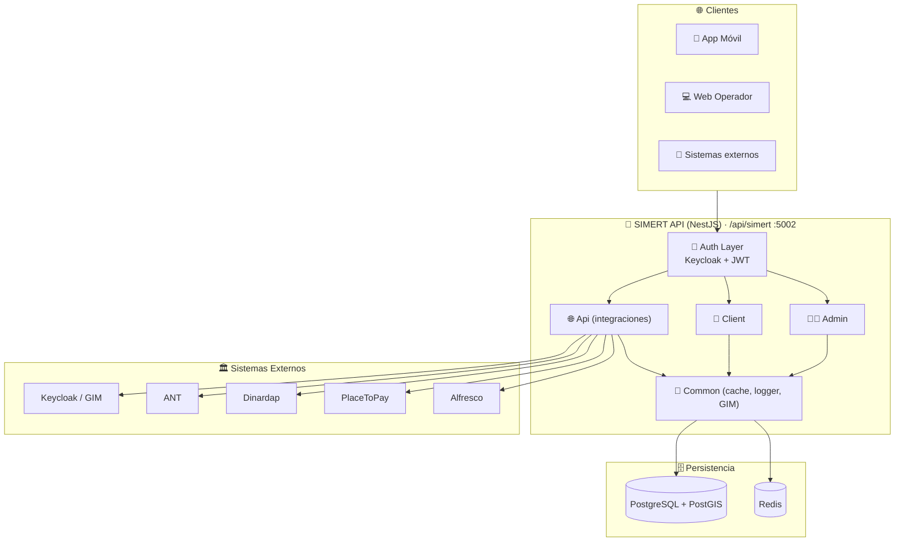

### Diagrama de Arquitectura · Detallado

```mermaid
flowchart LR
    subgraph HTTP["HTTP Layer"]
        MAIN["main.ts<br/>Helmet · CORS · GlobalPrefix"]
        MW["ResponseTimeMiddleware<br/>(MetaInterface)"]
        INT["Interceptores<br/>SystemStatus · CPU · Cache<br/>ETag · LogBody · Rate"]
    end

    subgraph Guards["Guards"]
        KTG["KeycloakTokenGuard"]
        RG["RoleGuard"]
    end

    subgraph Modules["Módulos"]
        A["src/admin/*<br/>23 submódulos"]
        C["src/client/*<br/>13 submódulos"]
        AP["src/api/*<br/>ant · dinardap-ant · gim · keycloak · portal"]
    end

    subgraph Services["Common Services"]
        CS["common.service"]
        CACHE["common.cache.service"]
        GIM["common.gim.service"]
        KC["common.keycloak.service"]
        LOG["logger.service"]
        BOOST["common.boost.service"]
        CFG["common.system-config.service"]
    end

    subgraph Data["Data Access"]
        TORM["TypeORM<br/>default · traking · tracking_controller"]
        RED["Redis (cache-manager)"]
    end

    MAIN --> MW --> INT --> Guards
    Guards --> Modules
    Modules --> Services
    Services --> TORM
    Services --> RED
```

### Diagrama de Componentes

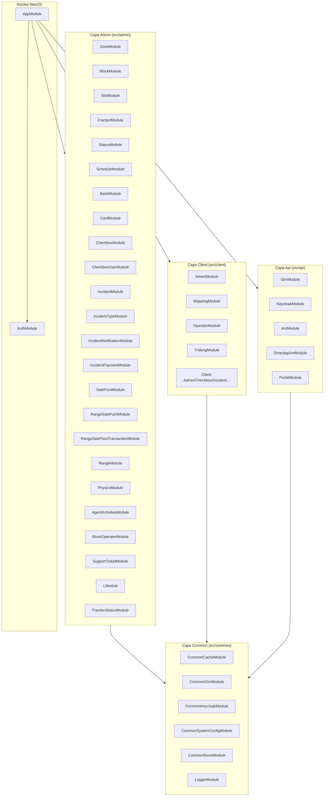

### Diagrama de Despliegue

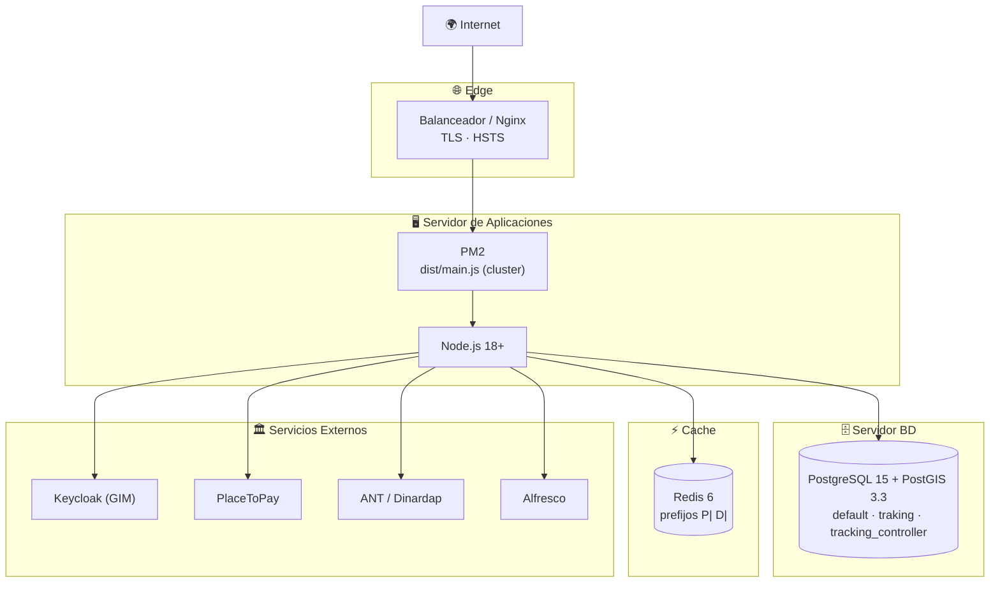

### Diagrama de Casos de Uso

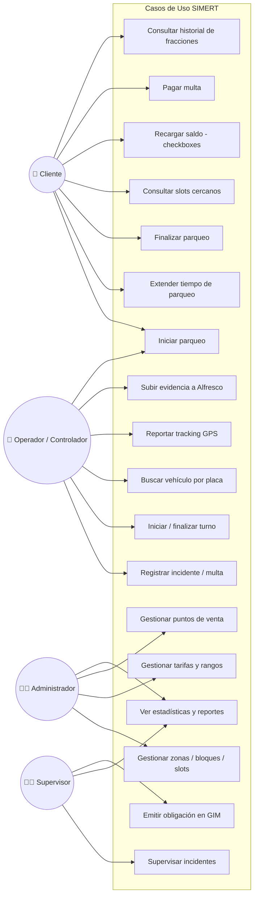

### Diagrama de Clases UML (src/admin)

> Un diagrama por cada entidad declarada en `src/admin/<módulo>/entities/`. Refleja atributos, tipos, claves primarias, relaciones declaradas por TypeORM y métodos de instancia cuando aplican.

**Entidades:** [Zone](#zone) · [Block](#block) · [Slot](#slot) · [Fraction](#fraction) · [Status](#status) · [FractionStatus](#fractionstatus) · [Schedule](#schedule) · [BlockOperator](#blockoperator) · [Bank](#bank) · [SalePoint](#salepoint) · [RangeSalePoint](#rangesalepoint) · [RangeSalePointTransaction](#rangesalepointtransaction) · [Incident](#incident) · [IncidentType](#incidenttype) · [IncidentNotification](#incidentnotification) · [IncidentPayment](#incidentpayment) · [Card](#card) · [Checkbox](#checkbox) · [CheckboxUser](#checkboxuser) · [Range](#range) · [Physic](#physic) · [AgentActivity](#agentactivity) · [SupportTicket](#supportticket) · [L](#l)

#### Zone

Archivo: [`src/admin/zone/entities/zone.entity.ts`](src/admin/zone/entities/zone.entity.ts)

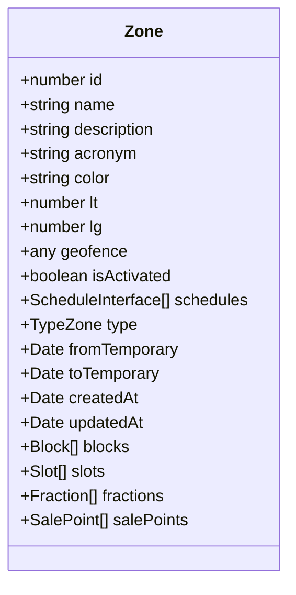

#### Block

Archivo: [`src/admin/block/entities/block.entity.ts`](src/admin/block/entities/block.entity.ts)

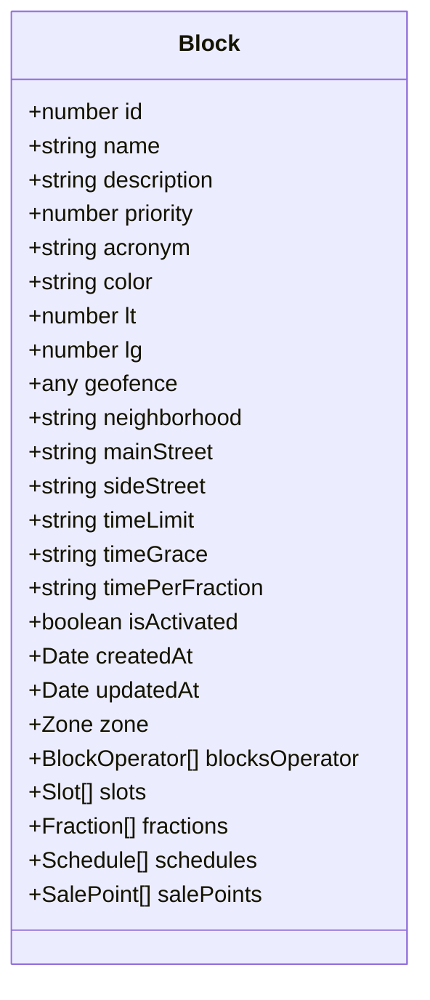

#### Slot

Archivo: [`src/admin/slot/entities/slot.entity.ts`](src/admin/slot/entities/slot.entity.ts)

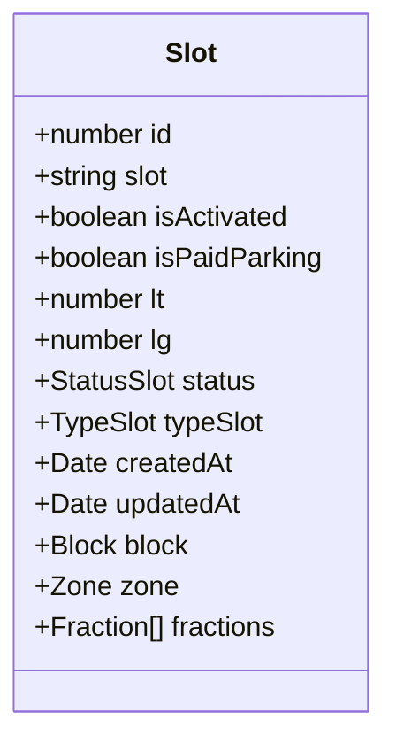

#### Fraction

Archivo: [`src/admin/fraction/entities/fraction.entity.ts`](src/admin/fraction/entities/fraction.entity.ts)

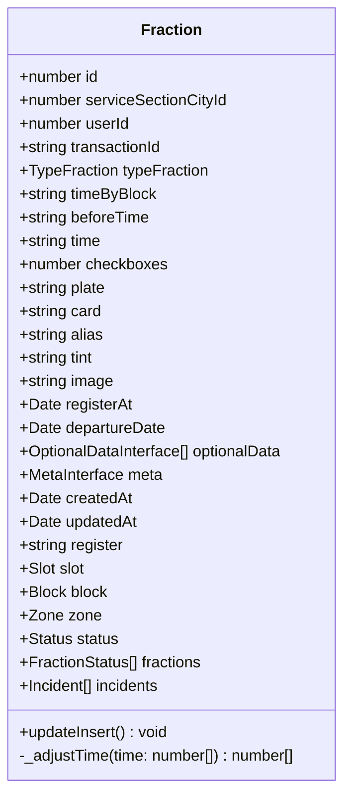

#### Status

Archivo: [`src/admin/status/entities/status.entity.ts`](src/admin/status/entities/status.entity.ts)

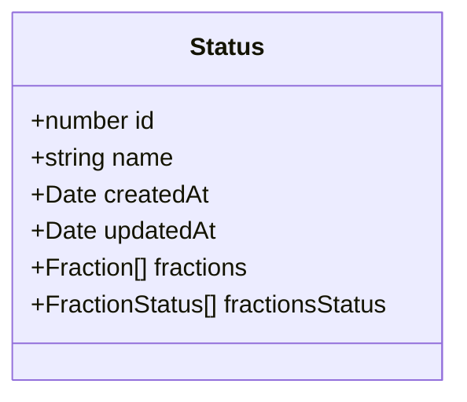

#### FractionStatus

Archivo: [`src/admin/fraction_status/entities/fraction_status.entity.ts`](src/admin/fraction_status/entities/fraction_status.entity.ts)

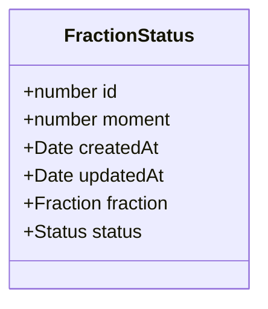

#### Schedule

Archivo: [`src/admin/schedule/entities/schedule.entity.ts`](src/admin/schedule/entities/schedule.entity.ts)

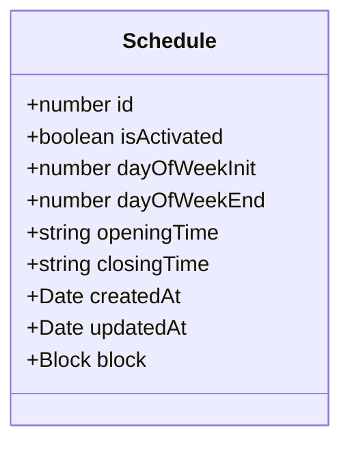

#### BlockOperator

Archivo: [`src/admin/block_operator/entities/block_operator.entity.ts`](src/admin/block_operator/entities/block_operator.entity.ts)

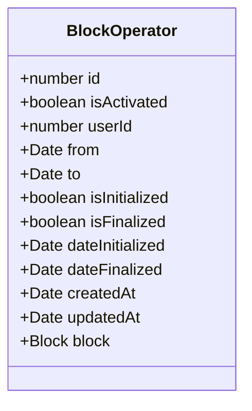

#### Bank

Archivo: [`src/admin/bank/entities/bank.entity.ts`](src/admin/bank/entities/bank.entity.ts)

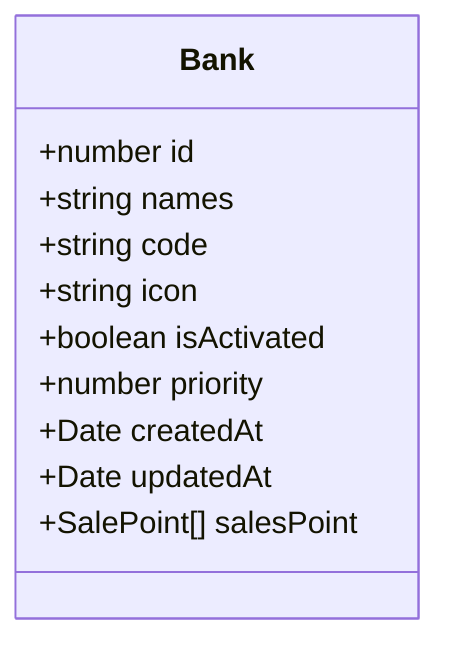

#### SalePoint

Archivo: [`src/admin/sale-point/entities/sale-point.entity.ts`](src/admin/sale-point/entities/sale-point.entity.ts)

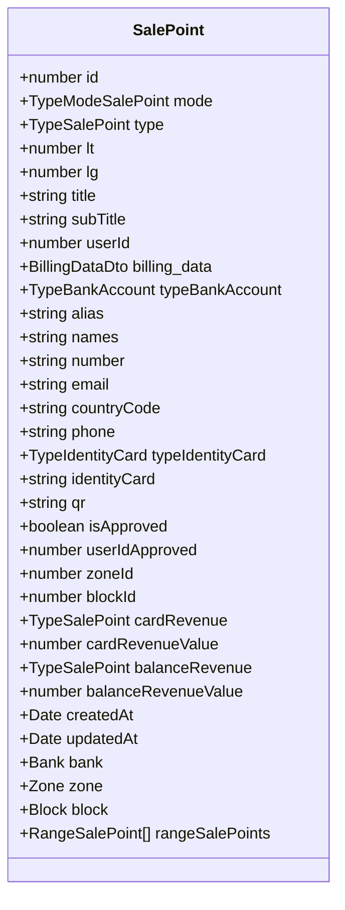

#### RangeSalePoint

Archivo: [`src/admin/range-sale-point/entities/range-sale-point.entity.ts`](src/admin/range-sale-point/entities/range-sale-point.entity.ts)

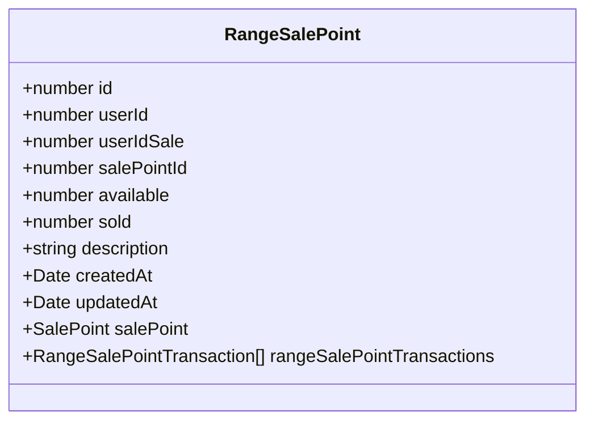

#### RangeSalePointTransaction

Archivo: [`src/admin/range-sale-point-transaction/entities/range-sale-point-transaction.entity.ts`](src/admin/range-sale-point-transaction/entities/range-sale-point-transaction.entity.ts)

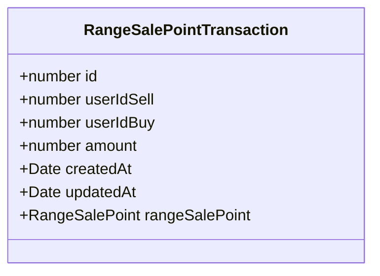

#### Incident

Archivo: [`src/admin/incident/entities/incident.entity.ts`](src/admin/incident/entities/incident.entity.ts)

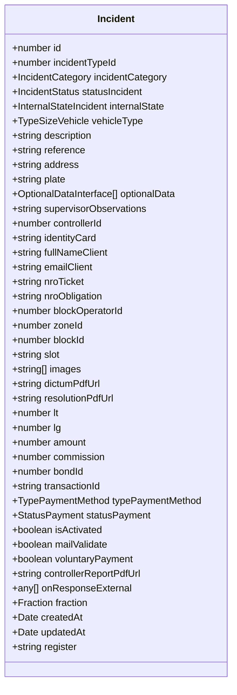

#### IncidentType

Archivo: [`src/admin/incident-type/entities/incident-type.entity.ts`](src/admin/incident-type/entities/incident-type.entity.ts)

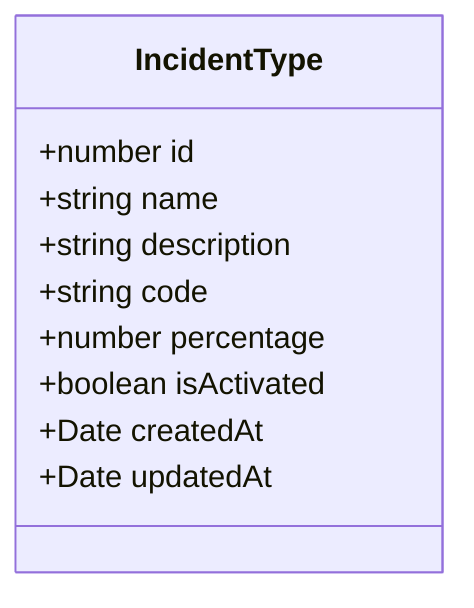

#### IncidentNotification

Archivo: [`src/admin/incident-notification/entities/incident-notification.entity.ts`](src/admin/incident-notification/entities/incident-notification.entity.ts)

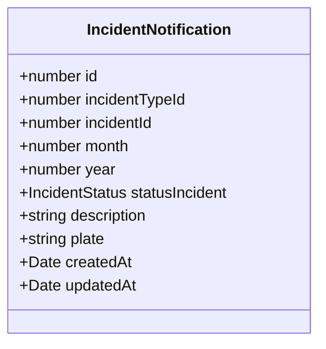

#### IncidentPayment

Archivo: [`src/admin/incident-payment/entities/incident-payment.entity.ts`](src/admin/incident-payment/entities/incident-payment.entity.ts)

```mermaid
classDiagram
    class IncidentPayment {
        +number id
        +number userId
        +number incidentId
        +string referenceId
        +BillingDataDto billing_data
        +string amount
        +string transactionId
        +StatusMoment moment
        +TypePaymentMethod typePaymentMethod
        +StatusPayment statusPayment
        +string url
        +OptionalDataInterface[] optionalData
        +Date createdAt
        +Date updatedAt
        +string register
    }
```

#### Card

Archivo: [`src/admin/card/entities/card.entity.ts`](src/admin/card/entities/card.entity.ts)

```mermaid
classDiagram
    class Card {
        +number id
        +string name
        +boolean isActivated
        +number price
        +number commission
        +number checkboxes
        +Date createdAt
        +Date updatedAt
    }
```

#### Checkbox

Archivo: [`src/admin/checkbox/entities/checkbox.entity.ts`](src/admin/checkbox/entities/checkbox.entity.ts)

```mermaid
classDiagram
    class Checkbox {
        +number id
        +number userId
        +string identityCard
        +string amount
        +string commission
        +string transactionId
        +number checkboxes
        +StatusMoment moment
        +TypePaymentMethod typePaymentMethod
        +string balance
        +number cardId
        +StatusPayment statusPayment
        +BillingDataDto billing_data
        +string url
        +IncidentStatus statusIncident
        +any[] onResponseExternal
        +Date createdAt
        +Date updatedAt
        +string register
    }
```

#### CheckboxUser

Archivo: [`src/admin/checkbox-user/entities/checkbox-user.entity.ts`](src/admin/checkbox-user/entities/checkbox-user.entity.ts)

```mermaid
classDiagram
    class CheckboxUser {
        +number id
        +number userId
        +number checkboxes
        +Date createdAt
        +Date updatedAt
    }
```

#### Range

Archivo: [`src/admin/range/entities/range.entity.ts`](src/admin/range/entities/range.entity.ts)

```mermaid
classDiagram
    class Range {
        +number id
        +string description
        +number batchNumber
        +TypeCard type
        +StatusRange status
        +Date authorizationDate
        +string from
        +string to
        +boolean isActivated
        +Date createdAt
        +Date updatedAt
    }
```

#### Physic

Archivo: [`src/admin/physics/entities/physic.entity.ts`](src/admin/physics/entities/physic.entity.ts)

```mermaid
classDiagram
    class Physic {
        +number id
        +number userId
        +number zoneId
        +string card
        +string time
        +number checkboxes
        +string timeByBlock
        +Date registerAt
        +Date createdAt
        +Date updatedAt
    }
```

#### AgentActivity

Archivo: [`src/admin/agent-activities/entities/agent-activity.entity.ts`](src/admin/agent-activities/entities/agent-activity.entity.ts)

```mermaid
classDiagram
    class AgentActivity {
        +number id
        +number userId
        +number blockId
        +number blockOperatorId
        +TypeActivity type
        +string description
        +number lt
        +number lg
        +Date createdAt
        +Date updatedAt
    }
```

#### SupportTicket

Archivo: [`src/admin/support-ticket/entities/support-ticket.entity.ts`](src/admin/support-ticket/entities/support-ticket.entity.ts)

```mermaid
classDiagram
    class SupportTicket {
        +number id
        +number userId
        +SupportRequestType requestType
        +string message
        +SupportTicketStatus status
        +string emailClient
        +string[] image
        +SupportTicketType typeTicket
        +Date createdAt
        +Date updatedAt
    }
```

#### L

Archivo: [`src/admin/l/entities/l.entity.ts`](src/admin/l/entities/l.entity.ts)

```mermaid
classDiagram
    class L {
        +number userId
        +number taken
        +number latitude
        +number longitude
        +number heading
        +string polyline
        +Date timestamp
    }
```

### Diagrama Entidad-Relación (src/admin)

> Generado a partir de las relaciones declaradas con `@ManyToOne` / `@OneToMany` en [`src/admin/`](src/admin/). Las entidades sin FK declarada se listan al final.

```mermaid
erDiagram
    ZONE ||--o{ BLOCK : "contiene"
    ZONE ||--o{ SLOT : "contiene"
    ZONE ||--o{ FRACTION : "agrupa"
    ZONE ||--o{ SALE_POINT : "ubica"
    BLOCK ||--o{ SLOT : "contiene"
    BLOCK ||--o{ FRACTION : "registra"
    BLOCK ||--o{ SCHEDULE : "define"
    BLOCK ||--o{ BLOCK_OPERATOR : "asigna"
    BLOCK ||--o{ SALE_POINT : "ubica"
    SLOT ||--o{ FRACTION : "ocupa"
    STATUS ||--o{ FRACTION : "clasifica"
    STATUS ||--o{ FRACTION_STATUS : "historial"
    FRACTION ||--o{ FRACTION_STATUS : "auditoría"
    FRACTION ||--o{ INCIDENT : "origina"
    BANK ||--o{ SALE_POINT : "respalda"
    SALE_POINT ||--o{ RANGE_SALE_POINT : "emite"
    RANGE_SALE_POINT ||--o{ RANGE_SALE_POINT_TRANSACTION : "transfiere"

    ZONE {
        int id PK
        varchar name
        varchar description
        varchar acronym
        varchar color
        decimal lt
        decimal lg
        geometry geofence
        boolean isActivated
        json schedules
        int type
        timestamp fromTemporary
        timestamp toTemporary
        timestamp createdAt
        timestamp updatedAt
    }

    BLOCK {
        int id PK
        int zone_id FK
        varchar name
        varchar description
        int priority
        varchar acronym
        varchar color
        decimal lt
        decimal lg
        geometry geofence
        varchar neighborhood
        varchar mainStreet
        varchar sideStreet
        time timeLimit
        time timeGrace
        time timePerFraction
        boolean isActivated
        timestamp createdAt
        timestamp updatedAt
    }

    SLOT {
        int id PK
        int block_id FK
        int zone_id FK
        varchar slot
        boolean isActivated
        boolean isPaidParking
        decimal lt
        decimal lg
        int status
        int typeSlot
        timestamp createdAt
        timestamp updatedAt
    }

    FRACTION {
        int id PK
        int slot_id FK
        int block_id FK
        int zone_id FK
        int status_id FK
        int serviceSectionCityId
        int userId
        varchar transactionId
        int typeFraction
        time timeByBlock
        time beforeTime
        time time
        int checkboxes
        varchar plate
        varchar card
        varchar alias
        varchar tint
        varchar image
        timestamp registerAt
        timestamp departureDate
        json optionalData
        json meta
        timestamp createdAt
        timestamp updatedAt
        timestamp register
    }

    STATUS {
        int id PK
        varchar name
        timestamp createdAt
        timestamp updatedAt
    }

    FRACTION_STATUS {
        int id PK
        int fraction_id FK
        int status_id FK
        smallint moment
        timestamp createdAt
        timestamp updatedAt
    }

    SCHEDULE {
        int id PK
        int block_id FK
        boolean isActivated
        smallint dayOfWeekInit
        smallint dayOfWeekEnd
        time openingTime
        time closingTime
        timestamp createdAt
        timestamp updatedAt
    }

    BLOCK_OPERATOR {
        int id PK
        int block_id FK
        int userId
        boolean isActivated
        timestamp from
        timestamp to
        boolean isInitialized
        boolean isFinalized
        timestamp dateInitialized
        timestamp dateFinalized
        timestamp createdAt
        timestamp updatedAt
    }

    BANK {
        int id PK
        varchar names
        varchar code
        varchar icon
        boolean isActivated
        smallint priority
        timestamp createdAt
        timestamp updatedAt
    }

    SALE_POINT {
        int id PK
        int bank_id FK
        int zoneId FK
        int blockId FK
        int mode
        int type
        decimal lt
        decimal lg
        varchar title
        varchar subTitle
        int userId
        json billing_data
        int typeBankAccount
        varchar alias
        varchar names
        varchar number
        varchar email
        varchar countryCode
        varchar phone
        int typeIdentityCard
        varchar identityCard
        varchar qr
        boolean isApproved
        int userIdApproved
        int cardRevenue
        int cardRevenueValue
        int balanceRevenue
        int balanceRevenueValue
        timestamp createdAt
        timestamp updatedAt
    }

    RANGE_SALE_POINT {
        int id PK
        int salePointId FK
        int userId
        int userIdSale
        int available
        int sold
        varchar description
        timestamp createdAt
        timestamp updatedAt
    }

    RANGE_SALE_POINT_TRANSACTION {
        int id PK
        int rangeSalePoint_id FK
        int userIdSell
        int userIdBuy
        int amount
        timestamp createdAt
        timestamp updatedAt
    }

    INCIDENT {
        int id PK
        int fraction_id FK
        int incidentTypeId
        int incidentCategory
        int statusIncident
        int internalState
        int vehicleType
        varchar description
        uuid reference
        varchar address
        varchar plate
        json optionalData
        varchar supervisorObservations
        int controllerId
        varchar identityCard
        varchar fullNameClient
        varchar emailClient
        varchar nroTicket
        varchar nroObligation
        int blockOperatorId
        int zoneId
        int blockId
        varchar slot
        varchar_array images
        varchar dictumPdfUrl
        varchar resolutionPdfUrl
        decimal lt
        decimal lg
        decimal amount
        decimal commission
        int bondId
        varchar transactionId
        int typePaymentMethod
        int statusPayment
        boolean isActivated
        boolean mailValidate
        boolean voluntaryPayment
        varchar controllerReportPdfUrl
        json onResponseExternal
        timestamp createdAt
        timestamp updatedAt
        timestamp register
    }

    INCIDENT_TYPE {
        int id PK
        varchar name
        varchar description
        varchar code
        decimal percentage
        boolean isActivated
        timestamp createdAt
        timestamp updatedAt
    }

    INCIDENT_NOTIFICATION {
        int id PK
        int incidentTypeId
        int incidentId
        int month
        int year
        int statusIncident
        varchar description
        varchar plate
        timestamp createdAt
        timestamp updatedAt
    }

    INCIDENT_PAYMENT {
        int id PK
        int userId
        int incidentId
        varchar referenceId
        json billing_data
        numeric amount
        varchar transactionId
        smallint moment
        int typePaymentMethod
        int statusPayment
        varchar url
        json optionalData
        timestamp createdAt
        timestamp updatedAt
        timestamp register
    }

    CARD {
        int id PK
        varchar name
        boolean isActivated
        decimal price
        decimal commission
        smallint checkboxes
        timestamp createdAt
        timestamp updatedAt
    }

    CHECKBOX {
        int id PK
        int userId
        varchar identityCard
        numeric amount
        numeric commission
        varchar transactionId
        smallint checkboxes
        smallint moment
        int typePaymentMethod
        numeric balance
        int cardId
        int statusPayment
        json billing_data
        varchar url
        int statusIncident
        json onResponseExternal
        timestamp createdAt
        timestamp updatedAt
        timestamp register
    }

    CHECKBOX_USER {
        int id PK
        int userId
        int checkboxes
        timestamp createdAt
        timestamp updatedAt
    }

    RANGE {
        int id PK
        varchar description
        bigint batchNumber
        int type
        int status
        timestamp authorizationDate
        varchar from
        varchar to
        boolean isActivated
        timestamp createdAt
        timestamp updatedAt
    }

    PHYSIC {
        int id PK
        int userId
        int zoneId
        varchar card
        time time
        int checkboxes
        time timeByBlock
        timestamp registerAt
        timestamp createdAt
        timestamp updatedAt
    }

    AGENT_ACTIVITY {
        int id PK
        int userId
        int blockId
        int blockOperatorId
        int type
        varchar description
        decimal lt
        decimal lg
        timestamp createdAt
        timestamp updatedAt
    }

    SUPPORT_TICKET {
        int id PK
        int userId
        int requestType
        varchar message
        int status
        varchar emailClient
        varchar_array image
        int typeTicket
        timestamp createdAt
        timestamp updatedAt
    }

    L {
        int userId PK
        smallint taken
        decimal latitude
        decimal longitude
        decimal heading
        text polyline
        timestamp timestamp
    }
```

> 📎 **Tablas sin FK ORM (relación lógica mediante columnas `*Id`):** `IncidentType`, `IncidentNotification`, `IncidentPayment`, `Card`, `Checkbox`, `CheckboxUser`, `Range`, `Physic`, `AgentActivity`, `SupportTicket`, `L`.

### Diagramas de Secuencia

Flujos principales extraídos de [`src/admin/`](src/admin/) y [`src/client/`](src/client/), ordenados por criticidad operativa.

**Índice de flujos:**
- [Login de cliente (ServiceHub)](#login-de-cliente-servicehub)
- [Login de empleado municipal](#login-de-empleado-municipal)
- [Iniciar parqueo](#iniciar-parqueo)
- [Extender tiempo de parqueo](#extender-tiempo-de-parqueo)
- [Finalizar parqueo](#finalizar-parqueo)
- [Compra de checkboxes (recarga)](#compra-de-checkboxes-recarga)
- [Callback de pago de checkboxes](#callback-de-pago-de-checkboxes)
- [Disponibilidad de slots en tiempo real](#disponibilidad-de-slots-en-tiempo-real)
- [Registrar incidente (operador)](#registrar-incidente-operador)
- [Pagar multa](#pagar-multa)
- [Callback de pago de multa](#callback-de-pago-de-multa)
- [Consulta de placa ANT / Dinardap](#consulta-de-placa-ant--dinardap)
- [Iniciar turno de operador (BlockOperator)](#iniciar-turno-de-operador-blockoperator)
- [Reporte de tracking GPS](#reporte-de-tracking-gps)
- [Creación de zona / bloque / slot](#creación-de-zona--bloque--slot)
- [Transacción de RangeSalePoint (venta de saldo)](#transacción-de-rangesalepoint-venta-de-saldo)
- [Subida de evidencia a Alfresco](#subida-de-evidencia-a-alfresco)

#### Login de cliente (ServiceHub)

`POST /api/simert/api/keycloak/login-client` · [`CommonKeycloakService.loginClient`](src/common/common.keycloak.service.ts)

```mermaid
sequenceDiagram
    autonumber
    actor App as 📱 App Cliente
    participant C as KeycloakController
    participant S as CommonKeycloakService
    participant R as Redis
    participant KC as 🏛️ Keycloak (GIM2_REALM_SERVICE_HUB)

    App->>C: POST /login-client (username, password)
    C->>S: loginClient(dto)
    S->>R: GET cached admin token
    alt cache HIT
        R-->>S: admin token
    else cache MISS
        S->>KC: POST /token (client_credentials)
        KC-->>S: admin token
        S->>R: SET admin token (TTL ~30s)
    end
    S->>KC: POST /token grant=password (username, password)
    KC-->>S: { access_token, refresh_token, expires_in }
    S-->>C: tokens + user info
    C-->>App: 200 OK
```

#### Login de empleado municipal

`POST /api/simert/api/keycloak/login-client-municipality` · [`CommonKeycloakService.loginClientMunicipality`](src/common/common.keycloak.service.ts)

```mermaid
sequenceDiagram
    autonumber
    actor Op as 👮 Operador / Supervisor
    participant C as KeycloakController
    participant S as CommonKeycloakService
    participant KC as 🏛️ Keycloak (GIM2_REALM_MUNICIPIO_K)

    Op->>C: POST /login-client-municipality (username, password)
    C->>S: loginClientMunicipality(dto)
    S->>KC: POST /token grant=client_credentials
    KC-->>S: service token (sin cache)
    S->>KC: GET /users?username=...
    KC-->>S: user info + roles
    S-->>C: { access_token, user, roles }
    C-->>Op: 200 OK
```

#### Iniciar parqueo

`POST /api/simert/client/simert/parking/:userId/:idDevice/:version` · [`SimertService.parking`](src/client/simert/)

```mermaid
sequenceDiagram
    autonumber
    actor App as 📱 App Cliente
    participant C as SimertController
    participant G as KeycloakTokenGuard
    participant S as SimertService
    participant DB as PostgreSQL
    participant N as Notifications

    App->>C: POST /parking (plate, zoneId, blockId, slotId, checkboxes)
    C->>G: validate JWT (ServiceHub)
    G-->>C: user
    C->>S: parking(dto)
    S->>DB: BEGIN TRANSACTION
    S->>DB: SELECT Slot FOR UPDATE (status=AVAILABLE)
    S->>DB: SELECT CheckboxUser FOR UPDATE (pessimistic_write)
    alt isPaidParking = true
        S->>DB: CheckboxUser.checkboxes -= n
    end
    S->>DB: INSERT Fraction (@BeforeInsert calcula time + departureDate)
    S->>DB: UPDATE Slot.status = OCCUPIED
    S->>DB: INSERT FractionStatus (moment=REQUESTED)
    S->>DB: COMMIT
    S->>N: emit slot change
    S-->>C: Fraction { id, time, departureDate }
    C-->>App: 201 Created
```

#### Extender tiempo de parqueo

`POST /api/simert/client/simert/increment-time/:userId/:idDevice/:version` · [`SimertService.incrementTime`](src/client/simert/)

```mermaid
sequenceDiagram
    autonumber
    actor App as 📱 App Cliente
    participant C as SimertController
    participant G as KeycloakTokenGuard
    participant S as SimertService
    participant DB as PostgreSQL

    App->>C: POST /increment-time (fractionId, checkboxes)
    C->>G: validate JWT
    G-->>C: OK
    C->>S: incrementTime(dto)
    S->>DB: BEGIN TRANSACTION
    S->>DB: SELECT Fraction FOR UPDATE
    alt status = SANCTIONED
        S-->>C: throw Conflict
        C-->>App: 409 Conflict
    else válido
        S->>DB: SELECT CheckboxUser FOR UPDATE
        S->>DB: CheckboxUser.checkboxes -= n
        S->>DB: UPDATE Fraction.time / departureDate
        S->>DB: INSERT FractionStatus (moment=INCREMENTED)
        S->>DB: COMMIT
        S-->>C: Fraction updated
        C-->>App: 200 OK
    end
```

#### Finalizar parqueo

`POST /api/simert/client/simert/finished/:userId/:idDevice/:fractionId/:version` · [`SimertService.finished`](src/client/simert/)

```mermaid
sequenceDiagram
    autonumber
    actor App as 📱 App Cliente
    participant C as SimertController
    participant G as KeycloakTokenGuard
    participant S as SimertService
    participant DB as PostgreSQL
    participant N as Notifications

    App->>C: POST /finished/:fractionId
    C->>G: validate JWT
    G-->>C: OK
    C->>S: finished(fractionId)
    S->>DB: BEGIN TRANSACTION
    S->>DB: SELECT Fraction FOR UPDATE
    S->>DB: UPDATE Fraction.status = FINISHED
    S->>DB: UPDATE Slot.status = AVAILABLE
    S->>DB: INSERT FractionStatus (moment=FINISHED)
    S->>DB: COMMIT
    S->>N: emit slot change
    S-->>C: Fraction { id, register }
    C-->>App: 200 OK
```

#### Compra de checkboxes (recarga)

`POST /api/simert/client/checkbox/buy-checkboxs/:userId/:idDevice/:version` · [`CheckboxService.buyCheckboxs`](src/client/checkbox/)

```mermaid
sequenceDiagram
    autonumber
    actor App as 📱 App Cliente
    participant C as CheckboxController
    participant G as KeycloakTokenGuard
    participant S as CheckboxService
    participant GIM as 🏛️ GIM
    participant P2P as 💳 PlaceToPay
    participant DB as PostgreSQL

    App->>C: POST /buy-checkboxs (cantidad, identityCard, typePaymentMethod)
    C->>G: validate JWT
    G-->>C: OK
    C->>S: buyCheckboxs(dto)
    S->>GIM: findOrCreateClient(identityCard)
    GIM-->>S: residentId
    S->>P2P: createSession(amount, reference)
    P2P-->>S: { url, requestId, referenceId }
    S->>DB: INSERT Checkbox (status=WAITING, referenceId, url)
    S-->>C: { url, referenceId }
    C-->>App: 200 OK + checkout URL
```

#### Callback de pago de checkboxes

`PATCH /api/simert/client/checkbox/on-response-pay/...` · [`CheckboxService.onResponsePay`](src/client/checkbox/)

```mermaid
sequenceDiagram
    autonumber
    participant P2P as 💳 PlaceToPay
    participant C as CheckboxController
    participant S as CheckboxService
    participant DB as PostgreSQL
    participant GIM as 🏛️ GIM
    participant N as Notifications

    P2P->>C: PATCH /on-response-pay (status, referenceId, transactionId)
    Note over C: sin KeycloakTokenGuard (webhook)
    C->>S: onResponsePay(payload)
    S->>DB: SELECT Checkbox WHERE referenceId = ?
    alt status = APPROVED
        S->>DB: BEGIN TRANSACTION
        S->>DB: UPDATE Checkbox.statusPayment = PAID
        S->>DB: SELECT CheckboxUser FOR UPDATE
        S->>DB: CheckboxUser.checkboxes += n
        S->>GIM: registerDeposit(residentId, amount)
        GIM-->>S: ack
        S->>DB: COMMIT
        S->>N: push "Recarga exitosa"
    else status = REJECTED
        S->>DB: UPDATE Checkbox.statusPayment = ERROR
    end
    C-->>P2P: 200 OK
```

#### Disponibilidad de slots en tiempo real

`GET /api/simert/client/mapping/find-slot-nearby/:userId/:idDevice/:latitude/:longitude/:version` · [`MappingService.findSlotNearby`](src/client/mapping/)

```mermaid
sequenceDiagram
    autonumber
    actor App as 📱 App Cliente
    participant C as MappingController
    participant G as KeycloakTokenGuard
    participant S as MappingService
    participant R as Redis
    participant DB as PostgreSQL/PostGIS

    App->>C: GET /find-slot-nearby (lat, lng)
    C->>G: validate JWT
    G-->>C: OK
    C->>S: findSlotNearby(lat, lng)
    S->>R: GET slots:status
    alt cache HIT
        R-->>S: slots[] con estado
    else cache MISS
        S->>DB: SELECT Slot JOIN Block JOIN Zone JOIN Schedule
        DB-->>S: slots + schedules + geofence
        S->>R: SET slots:status (TTL ~30s)
    end
    S->>S: filtrar AVAILABLE + schedule activo + Haversine
    S-->>C: slots[] { id, distance, status, timeByBlock }
    C-->>App: 200 OK
```

#### Registrar incidente (operador)

`POST /api/simert/client/operator/create-incident/:userId/:idDevice` · [`OperatorService.createIncident`](src/client/operator/)

```mermaid
sequenceDiagram
    autonumber
    actor Op as 👮 Operador
    participant C as OperatorController
    participant G as KeycloakTokenGuard
    participant S as OperatorService
    participant ANT as 🚗 ANT/Dinardap
    participant GIM as 🏛️ GIM
    participant DB as PostgreSQL

    Op->>C: POST /create-incident (plate, typeId, zoneId, blockId, slot, lt/lg, images[])
    C->>G: validate JWT (MunicipioK)
    G-->>C: user = CONTROLLER
    C->>S: createIncident(dto)
    S->>ANT: lookupByPlate(plate)
    ANT-->>S: { identityCard, fullName, email }
    S->>DB: BEGIN TRANSACTION
    S->>DB: SELECT Fraction WHERE plate = ? AND status = ACTIVE
    S->>GIM: issueIncident(rubro, identityCard, amount)
    GIM-->>S: { bondId, nroObligation }
    S->>DB: INSERT Incident (statusIncident=ENTERED, bondId)
    S->>DB: UPDATE Fraction.status = SANCTIONED
    S->>DB: INSERT FractionStatus (moment=SANCTIONED)
    S->>DB: COMMIT
    S-->>C: Incident { id, nroObligation }
    C-->>Op: 201 Created
```

#### Pagar multa

`POST /api/simert/client/incident/pay/:userId/:idDevice/:version` · [`IncidentService.pay`](src/client/incident/)

```mermaid
sequenceDiagram
    autonumber
    actor App as 📱 App Cliente
    participant C as IncidentController
    participant G as KeycloakTokenGuard
    participant S as IncidentService
    participant GIM as 🏛️ GIM
    participant P2P as 💳 PlaceToPay
    participant DB as PostgreSQL

    App->>C: POST /incident/pay (incidentId, typePaymentMethod, billing_data)
    C->>G: validate JWT
    G-->>C: OK
    C->>S: pay(dto)
    S->>GIM: checkObligation(bondId)
    GIM-->>S: obligation vigente
    alt typePaymentMethod = CHECKBOX
        S->>DB: BEGIN TRANSACTION
        S->>DB: SELECT CheckboxUser FOR UPDATE
        S->>DB: CheckboxUser.checkboxes -= amount
        S->>GIM: registerPayment(bondId, amount)
        S->>DB: UPDATE Incident.statusPayment = PAID
        S->>DB: INSERT IncidentPayment (statusPayment=PAID)
        S->>DB: COMMIT
        S-->>C: { paid: true }
    else typePaymentMethod = CARD
        S->>P2P: createSession(amount, reference)
        P2P-->>S: { url, referenceId }
        S->>DB: INSERT IncidentPayment (statusPayment=WAITING, url)
        S-->>C: { url, referenceId }
    end
    C-->>App: 200 OK
```

#### Callback de pago de multa

`PATCH /api/simert/client/incident/on-response-pay/...` · [`IncidentService.onResponsePay`](src/client/incident/)

```mermaid
sequenceDiagram
    autonumber
    participant P2P as 💳 PlaceToPay
    participant C as IncidentController
    participant S as IncidentService
    participant DB as PostgreSQL
    participant GIM as 🏛️ GIM
    participant N as Notifications

    P2P->>C: PATCH /on-response-pay (status, referenceId, transactionId)
    Note over C: webhook · sin guard
    C->>S: onResponsePay(payload)
    S->>DB: SELECT IncidentPayment WHERE referenceId = ?
    alt status = APPROVED
        S->>DB: BEGIN TRANSACTION
        S->>DB: UPDATE IncidentPayment.statusPayment = PAID
        S->>DB: UPDATE Incident.statusPayment = PAID
        S->>GIM: registerDeposit(bondId, amount)
        GIM-->>S: ack
        S->>DB: COMMIT
        S->>N: push "Multa pagada correctamente"
    else status = REJECTED
        S->>DB: UPDATE IncidentPayment.statusPayment = ERROR
    end
    C-->>P2P: 200 OK
```

#### Consulta de placa ANT / Dinardap

`GET /api/simert/api/ant/get-user-data-by-plate-ant/...` · [`AntService`](src/api/ant/) · [`DinardapAntService`](src/api/dinardap-ant/)

```mermaid
sequenceDiagram
    autonumber
    actor Op as 👮 Operador
    participant C as AntController
    participant G as KeycloakTokenGuard
    participant S as AntService
    participant DIN as 🚗 Dinardap
    participant ANT as 🚗 ANT

    Op->>C: GET /get-user-data-by-plate-ant/:plate
    C->>G: validate JWT
    G-->>C: OK
    C->>S: getByPlate(plate)
    S->>DIN: lookup(plate)
    DIN-->>S: { identityCard, fullName, email }
    opt sin respuesta
        S->>ANT: lookup(plate)
        ANT-->>S: { vehicleInfo }
    end
    S-->>C: { plate, identityCard, fullName, email }
    C-->>Op: 200 OK
```

#### Iniciar turno de operador (BlockOperator)

`POST /api/simert/admin/block-operator/...` · [`BlockOperatorService`](src/admin/block_operator/)

```mermaid
sequenceDiagram
    autonumber
    actor Op as 👮 Operador
    participant C as BlockOperatorController
    participant G as KeycloakTokenGuard
    participant S as BlockOperatorService
    participant DB as PostgreSQL
    participant AG as AgentActivityService

    Op->>C: POST /block-operator (blockId, from, to)
    C->>G: validate JWT
    G-->>C: OK
    C->>S: initialize(dto)
    S->>DB: UPDATE BlockOperator<br/>(isInitialized=true, dateInitialized=now)
    S->>AG: log activity (type=SHIFT_START)
    AG->>DB: INSERT AgentActivity
    S-->>C: { id, block, dateInitialized }
    C-->>Op: 200 OK
```

#### Reporte de tracking GPS

`PATCH /api/simert/client/traking/p/:userId` · [`TrakingService.plot`](src/client/traking/)

```mermaid
sequenceDiagram
    autonumber
    actor Op as 👮 Operador
    participant C as TrakingController
    participant S as TrakingService
    participant R as Redis
    participant DB as PostgreSQL (tracking)

    Op->>C: PATCH /p/:userId (lat, lng, heading, polyline)
    C->>S: plot(userId, payload)
    S->>R: SET last-known:userId (TTL)
    S->>DB: UPSERT L (userId, lat, lng, heading, polyline, timestamp)
    S-->>C: ack
    C-->>Op: 200 OK
```

#### Creación de zona / bloque / slot

`POST /api/simert/admin/zone/...` · `POST /api/simert/admin/block/...` · `POST /api/simert/admin/slot/...`

```mermaid
sequenceDiagram
    autonumber
    actor Admin as 🧑‍💻 Admin
    participant C as ZoneController
    participant G as KeycloakTokenGuard
    participant Z as ZoneService
    participant BC as BlockController
    participant B as BlockService
    participant SC as SlotController
    participant SS as SlotService
    participant DB as PostgreSQL (PostGIS)

    Admin->>C: POST /admin/zone (name, geofence, schedules)
    C->>G: validate JWT (MunicipioK, ADMIN)
    G-->>C: OK
    C->>Z: create(dto)
    Z->>DB: INSERT Zone (geofence GEOMETRY)
    Z-->>C: Zone
    C-->>Admin: 201 Created

    Admin->>BC: POST /admin/block (zoneId, geofence, tarifas)
    BC->>B: create(dto)
    B->>DB: INSERT Block (zone_id)
    B-->>BC: Block
    BC-->>Admin: 201 Created

    Admin->>SC: POST /admin/slot (blockId, zoneId, lt, lg)
    SC->>SS: create(dto)
    SS->>DB: INSERT Slot (block_id, zone_id, status=AVAILABLE)
    SS-->>SC: Slot
    SC-->>Admin: 201 Created
```

#### Transacción de RangeSalePoint (venta de saldo)

`POST /api/simert/admin/range-sale-point-transaction/create/...` · [`RangeSalePointTransactionService`](src/admin/range-sale-point-transaction/)

```mermaid
sequenceDiagram
    autonumber
    actor Sp as 🏪 Punto de Venta
    participant C as RSPTController
    participant G as KeycloakTokenGuard
    participant S as RSPTService
    participant DB as PostgreSQL

    Sp->>C: POST /create (rangeSalePointId, userIdBuy, amount)
    C->>G: validate JWT
    G-->>C: OK
    C->>S: create(dto)
    S->>DB: BEGIN TRANSACTION
    S->>DB: SELECT RangeSalePoint FOR UPDATE
    S->>DB: RangeSalePoint.available -= amount
    S->>DB: RangeSalePoint.sold += amount
    S->>DB: INSERT RangeSalePointTransaction
    S->>DB: SELECT CheckboxUser FOR UPDATE (userIdBuy)
    S->>DB: CheckboxUser.checkboxes += amount
    S->>DB: COMMIT
    S-->>C: { txId }
    C-->>Sp: 201 Created
```

#### Subida de evidencia a Alfresco

`POST /api/simert/admin/incident/upload-alfresco/:userId/:idDevice` · [`IncidentService.uploadAlfresco`](src/admin/incident/)

```mermaid
sequenceDiagram
    autonumber
    actor Op as 👮 Operador
    participant C as IncidentController
    participant G as KeycloakTokenGuard
    participant S as IncidentService
    participant ALF as 🗄️ Alfresco
    participant DB as PostgreSQL

    Op->>C: POST /upload-alfresco (incidentId, file)
    C->>G: validate JWT
    G-->>C: OK
    C->>S: uploadAlfresco(file, incidentId)
    S->>ALF: POST /nodes/.../children (multipart)
    ALF-->>S: { alfrescoId, url }
    S->>DB: UPDATE Incident.images[] += alfrescoId
    S-->>C: { alfrescoId, url }
    C-->>Op: 200 OK
```

---

## 📡 Documentación Técnica

### API (OpenAPI / Swagger)

El backend expone documentación interactiva vía Swagger UI:

> 📘 **URL Swagger:** `${TypePrefix.API_SIMERT}internal/docs` → `http://{host}:{port}/api/simert/internal/docs`

Configurado en [`src/main.ts`](src/main.ts) con:

- **Título:** Parking Simert API
- **Secciones (tags):** `Auth`, `Admin`, `Client`, `Api`
- **Autenticación:** Bearer JWT (Keycloak)
- **Opciones:** `persistAuthorization`, ordenamiento alfabético de tags y operaciones

#### Prefijo global

Todas las rutas cuelgan de `/api/simert/` (ver `TypePrefix.API_SIMERT`).

#### Resumen de endpoints por capa

**🔐 Auth / Keycloak** — `src/api/keycloak/`

| Método | Ruta | Descripción |
|---|---|---|
| POST | `/api/keycloak/login-client` | Login ServiceHub (clientes) |
| POST | `/api/keycloak/login-client-municipality` | Login empleado municipal |
| POST | `/api/keycloak/create-user` | Crear usuario ServiceHub |
| POST | `/api/keycloak/create-user-municipality` | Crear usuario municipal |
| PUT | `/api/keycloak/update-user/:id` | Actualizar usuario ServiceHub |
| PUT | `/api/keycloak/update-user-municipality/:id` | Actualizar usuario municipal |
| GET | `/api/keycloak/find-by-username/:username` | Buscar usuario ServiceHub |
| GET | `/api/keycloak/find-by-email` | Buscar usuario ServiceHub por email |
| GET | `/api/keycloak/find-by-username-municipality/:username` | Buscar usuario municipal |
| GET | `/api/keycloak/find-by-email-municipality` | Buscar usuario municipal por email |

**🏛️ Integración GIM** — `src/api/gim/`

| Método | Ruta | Descripción |
|---|---|---|
| POST | `/api/gim/issue-incident-gim/:userId/:idDevice/:id/:isTransacional` | Emitir incidente en GIM |
| POST | `/api/gim/emit-infraction-simert/:userId/:idDevice/:id/:isTransacional` | Emitir infracción directa |
| POST | `/api/gim/create-client-gim/:idDevice` | Crear cliente GIM |
| POST | `/api/gim/create-client-gim-no-exist/:idDevice` | Crear cliente GIM (no registrado) |
| POST | `/api/gim/get-client-gim/:idDevice` | Obtener cliente GIM |
| POST | `/api/gim/find-bond-by-number/:userId/:idDevice` | Buscar obligación por número |
| GET | `/api/gim/verifate-incident-gim/:userId/:idDevice/:id` | Verificar incidente |
| GET | `/api/gim/validate-open-till/:userId/:idDevice/:id` | Validar caja abierta |
| POST | `/api/gim/find-vehicle-types-for-simert/:userId/:idDevice` | Tipos de vehículo |
| POST | `/api/gim/emission-title-credit-card/:userId/:idDevice` | Emisión título por tarjeta |
| POST | `/api/gim/register-deposit/:userId/:idDevice` | Registrar depósito |
| POST | `/api/gim/find-obligations/:userId/:idDevice` | Buscar obligaciones |
| POST | `/api/gim/find-obligations-by-citation/:userId/:idDevice` | Obligaciones por citación |
| POST | `/api/gim/validate-status-with-gim/:userId/:idDevice` | Validar estado con GIM |
| POST | `/api/gim/emit-sanction/:userId/:idDevice` | Emitir sanción |

**🚗 Integración ANT / Dinardap**

| Método | Ruta | Descripción |
|---|---|---|
| GET | `/api/ant` | Listar registros ANT |
| GET | `/api/ant/get-user-data-by-plate-ant/:userId/:idDevice` | Consulta de placa |
| GET | `/api/dinardap-ant/get-user-data-by-plate-ant/:userId/:idDevice` | Consulta Dinardap |
| GET | `/portal` · `/portal/:id` | Integración Portal |

**🧑‍💼 Admin** — `src/admin/` (extracto)

| Módulo | Endpoints destacados |
|---|---|
| `zone` | `POST /admin/zone`, `GET /admin/zone`, `GET /admin/zone/find-all-active`, `GET /admin/zone/filter/parking`, `PATCH /admin/zone/:id` |
| `block` | `POST /admin/block`, `GET /admin/block/all`, `GET /admin/block/filter/:zoneId`, `GET /admin/block/filter/parking`, `PATCH /admin/block/:id`, `DELETE /admin/block/:id`, `POST/GET/PATCH /admin/block/*-block-sector/*` |
| `slot` | `POST /admin/slot`, `GET /admin/slot/all`, `GET /admin/slot/filter/:blockId/:zoneId`, `GET /admin/slot/filter-slot-block/parking`, `GET /admin/slot/get-slots-by-polygon`, `PATCH /admin/slot/:id`, `GET /admin/slot/find-statistics` |
| `fraction` | `GET /admin/fraction/find-all-fractions`, `GET /admin/fraction/find-all-total-vehicle-client-time`, `GET /admin/fraction/find-all-total-occupation-rotation-parking`, `GET /admin/fraction/find-all-statistics` |
| `status` | `POST /admin/status/initializeDatabase`, `GET /admin/status/filter` |
| `schedule` | `POST /admin/schedule`, `GET /admin/schedule/by-block/:id`, `PATCH /admin/schedule/active/:id`, `PATCH /admin/schedule` |
| `incident` | `POST /admin/incident`, `PATCH /admin/incident/find-all`, `GET /admin/incident/:id`, `PATCH /admin/incident/update/:id`, `PATCH /admin/incident/update-status-gim/:id`, `POST /admin/incident/upload-alfresco`, `GET /admin/incident/get-file-url-alfresco/:alfrescoId`, `DELETE /admin/incident/remove/:id`, `GET /admin/incident/find-statistics`, `PATCH /admin/incident/advance-next-process` |
| `incident-type` | `POST /admin/incident-type/create`, `PATCH /admin/incident-type/find-all`, `GET /admin/incident-type/get-type-incident-by-id/:id`, `PATCH /admin/incident-type/update/:id`, `DELETE /admin/incident-type/remove/:id` |
| `card` | `POST /admin/card`, `GET /admin/card`, `GET /admin/card/find-total`, `PATCH /admin/card/:id` |
| `range` | `POST /admin/range/create`, `PATCH /admin/range/update/:id`, `GET /admin/range/findAll`, `GET /admin/range/verifyRange` |
| `sale-point` | `POST /admin/sale-point`, `GET /admin/sale-point`, `GET /admin/sale-point/filter`, `PATCH /admin/sale-point/:id`, `GET /admin/sale-point/exists/:targetUserId` |
| `range-sale-point-transaction` | `POST /admin/range-sale-point-transaction/create`, `GET /admin/range-sale-point-transaction/all`, `GET /admin/range-sale-point-transaction/total` |
| `agent-activities` | `GET /admin/agent-activities`, `GET /admin/agent-activities/total` |
| `physic` | `GET /admin/physic`, `GET /admin/physic/total` |

**👤 Client** — `src/client/` (extracto)

| Módulo | Endpoints destacados |
|---|---|
| `simert` | `POST /client/simert/parking`, `POST /client/simert/increment-time`, `POST /client/simert/finished/:fractionId`, `GET /client/simert/find-all-fractions`, `GET /client/simert/find-fraction-by-id/:fractionId`, `GET /client/simert/seach-slot/:searchSlot`, `GET /client/simert/find-fraction-history` |
| `mapping` | `GET /client/mapping/find-all-zone`, `GET /client/mapping/find-all-block`, `GET /client/mapping/find-all-slot`, `GET /client/mapping/find-slot-nearby/:latitude/:longitude` |
| `operator` | `POST /client/operator/create-incident`, `POST /client/operator/register`, `POST /client/operator/increment-time`, `POST /client/operator/finished/:fractionId`, `GET /client/operator/find-all-bloclks`, `GET /client/operator/find-all-fractions/:blockId`, `GET /client/operator/find-fraction-by-id/:fractionId`, `GET /client/operator/find-by-criteria/:criteria`, `GET /client/operator/time-virtual`, `GET /client/operator/find-all-physic/:card`, `GET /client/operator/seach-slot/:searchSlot`, `POST /client/operator/find-by-identity-card/:identityCard` |
| `incident` | `GET /client/incident/check-my-incidents-outstanding`, `GET /client/incident/find-all-sanctions-by-fraction/:fractionId`, `POST /client/incident/find-by-identity-card/:identityCard`, `POST /client/incident/pay`, `PATCH /client/incident/on-response-pay/...`, `DELETE /client/incident/on-response-pay/...`, `GET /client/incident/get-transactions-by-reference/:reference` |
| `admin` | `GET /client/admin/find-all-slots/:latitude/:longitude`, `DELETE /client/admin/delete-slot/:slotId`, `POST /client/admin/slot/create` |
| `traking` | `PATCH /client/traking/p/:userId`, `GET /client/traking/tracking-by-user-id/:userId`, `GET /client/traking/trackings/:userIds`, `GET /client/traking/vehicles-nearby/:latitude/:longitude/:zoom`, `GET /client/traking/all-tracking/:userId/:from/:to` |

> 📎 El inventario completo de DTOs, guards, roles y códigos de estado está disponible en Swagger (`/api/simert/internal/docs`) y en los controladores dentro de [`src/admin/`](src/admin/), [`src/client/`](src/client/) y [`src/api/`](src/api/).

### Redis y Estrategia de Cache

Redis actúa como capa de caché global para reducir latencia y evitar golpes repetidos a base de datos y a servicios externos.

**Configuración:** `cache-manager` + `cache-manager-redis-store` registrado en `CacheModule` de NestJS. Controlado por la variable `IS_CACHE`.

**Prefijos por entorno:**

| Entorno | Prefijo | Ejemplo |
|---|---|---|
| Producción | `P|` | `P|token:admin` |
| Desarrollo | `D|` | `D|token:admin` |

**Ejemplos de uso:**

| Clave / patrón | Uso | TTL aproximado |
|---|---|---|
| `token:admin-servicehub` | Token admin Keycloak (realm ServiceHub) | ~30s |
| `slots:status:<zoneId>` | Estado/ocupación de slots para endpoint de mapeo | ~30s |
| `system-config` | Configuración global (vía `CommonSystemConfigService`) | Variable |
| `block:*` / `zone:*` | Catálogo estático | Largo |

**Interceptores implicados:** `CacheInterceptor` y `CachePersistenceInterceptor` (en [`src/common/interceptors/`](src/common/interceptors/)) controlan invalidación y persistencia de la caché HTTP.

### Despliegue

#### Ambientes

| Entorno | Propósito | `NODE_ENV` | Prefijo Redis |
|---|---|---|---|
| `development` | Desarrollo local | `development` | `D|` |
| `staging` | QA / aceptación | `staging` | `D|` (o el definido) |
| `production` | Producción | `production` | `P|` |

#### Flujo paso a paso

```bash
# 1. Obtener el código
git pull origin main

# 2. Instalar dependencias (respetando lock)
npm ci

# 3. Configurar variables de entorno
cp .env.example .env   # y editar credenciales

# 4. Compilar
npm run build          # genera dist/

# 5. Ejecutar con PM2 (producción)
NODE_ENV=production pm2 start dist/main.js --name 3007:SIMERT
pm2 save
pm2 startup
```

#### Dependencias externas

- PostgreSQL 15 con extensión **PostGIS 3.3** habilitada (`CREATE EXTENSION postgis;`).
- Redis 6+ accesible desde el servidor de aplicaciones.
- Keycloak / GIM con ambos realms configurados (`GIM2_REALM_SERVICE_HUB` y `GIM2_REALM_MUNICIPIO_K`).
- Acceso de red a PlaceToPay, ANT, Dinardap y Alfresco.

#### Checklist de despliegue

- [ ] Variables de entorno definidas (ver sección de instalación).
- [ ] `SYNCHRONIZE=FALSE` en producción.
- [ ] Backups y migraciones aplicadas.
- [ ] CORS (`PRODUCTION_ALLOWED_DOMAIN`) actualizado.
- [ ] `npm run build` sin errores.
- [ ] PM2 con `pm2 startup` y `pm2 save` ejecutados.
- [ ] Logs monitoreados (PM2 + logger propio).

### Git · Estrategia de Ramas

> No se pudo determinar una convención formal a partir del código fuente. Se recomienda adoptar **Git Flow simplificado** como estándar del proyecto:

| Rama | Propósito |
|---|---|
| `main` | Código productivo estable. Solo recibe merges desde `release/*` o `hotfix/*`. |
| `develop` | Integración de features antes de release. |
| `feature/<nombre>` | Desarrollo de nuevas funcionalidades. Parte de `develop`. |
| `release/<version>` | Estabilización previa al despliegue. |
| `hotfix/<nombre>` | Correcciones urgentes sobre `main`. |

**Convención de commits sugerida (Conventional Commits):**

```
feat(simert): agregar validación de placa en parking
fix(incident): corregir cálculo de comisión en multa
chore(deps): actualizar @nestjs/swagger a 7.4.2
docs(readme): reescribir sección de despliegue
refactor(cache): simplificar prefijos por entorno
```

### Releases y Versionado

- Versionado sugerido: **SemVer** (`MAJOR.MINOR.PATCH`).
- Incremento del campo `version` en [`package.json`](package.json) por cada release.
- Tag de Git por release: `git tag -a v0.0.119 -m "Release 0.0.119"`.
- Changelog recomendado en `CHANGELOG.md` siguiendo [keep a changelog](https://keepachangelog.com/).

### Logging y Manejo de Errores

#### Logging

- Implementación central: [`src/common/logger.service.ts.ts`](src/common/logger.service.ts.ts).
- El middleware [`ResponseTimeMiddleware`](src/common/response-time.middleware.ts) enriquece cada petición con `req.meta` (device, GPS, IMEI, batería, SO) y loggea peticiones cuya duración supera `TIME_THRESHOLD_LOG_MS`.
- Interceptores `SystemStatusInterceptor`, `CPUInterceptor`, `LogBodyInterceptor` y `RateInterceptor` añaden telemetría (uso de CPU, tamaño de payload, rate).

#### Niveles

| Nivel | Uso |
|---|---|
| `info` | Eventos de negocio relevantes (parqueo creado, pago acreditado). |
| `warn` | Reintentos, estados inesperados no críticos (p. ej. caché miss recurrente). |
| `error` | Excepciones no controladas, fallos de integraciones externas. |
| `debug` | Solo en `NODE_ENV=development`. |

#### Manejo de errores

- Cada servicio captura errores de BD mediante `handleDbExceptions(error)` ([`src/common/exceptions/`](src/common/exceptions/)), que mapea códigos de PostgreSQL a excepciones de NestJS (`BadRequestException`, `ConflictException`, `InternalServerErrorException`).
- Excepciones HTTP de NestJS se serializan automáticamente como JSON con `statusCode`, `message` y `error`.
- Validación de DTOs mediante `class-validator` configurado globalmente como `ValidationPipe` en `main.ts`.

### Seguridad

- **TLS + HSTS** a nivel Helmet (`max-age 31536000`, `includeSubDomains`, `preload`).
- **Content-Security-Policy** estricta configurada en `main.ts`.
- **Frameguard:** `sameorigin`. **Hide-powered-by** habilitado. **XSS-filter** activo.
- **CORS** con whitelist explícita por `DEVELOPMENT_ALLOWED_DOMAIN` / `PRODUCTION_ALLOWED_DOMAIN`, `credentials: true`, métodos y headers controlados.
- **Headers personalizados admitidos:** `platform`, `brand`, `versionapp`, `Authorization`, `Content-Type`.
- **JWT** firmado con `JWT_SECREAT` (typo intencional heredado del ecosistema SIMERT — no corregir).
- **Keycloak `KeycloakTokenGuard`** valida y refresca el token por request y selecciona el realm según el rol detectado.
- **Rate limiting** aplicado por `RateInterceptor`.

---

## 👨‍💻 Manuales

### Manual de Desarrollador

#### Arquitectura del proyecto

El proyecto sigue el patrón **modular de NestJS**, con cinco capas principales (`admin`, `client`, `api`, `auth`, `common`). Cada capa se expresa como conjunto de módulos autoconsistentes con su `controller`, `service`, `entities`, `dto/` y `interfaces/`.

**Flujo de una petición típica:**

1. Llega a `main.ts` y pasa por Helmet + CORS.
2. `ResponseTimeMiddleware` construye `req.meta` (MetaInterface).
3. Cadena de interceptores global: `SystemStatusInterceptor → CPUInterceptor → CacheInterceptor → CachePersistenceInterceptor → ETagInterceptor → LogBodyInterceptor → RateInterceptor`.
4. `KeycloakTokenGuard` valida y, si aplica, refresca el JWT.
5. `@Auth(...roles)` / `@RoleProtected(...)` verifican permisos.
6. `@GetUser()` y `@GetMeta()` inyectan usuario y metadatos en el controlador.
7. El servicio ejecuta lógica de dominio (con `pessimistic_write` lock cuando mueve saldo).
8. Los errores de BD pasan por `handleDbExceptions`.

#### Estructura de carpetas

```
parking_simert/
├── src/
│   ├── main.ts                   # Bootstrap + Helmet + CORS + Swagger + Prefix
│   ├── app.module.ts             # Root module (TypeORM multi-DB, Cache, módulos)
│   ├── app.controller.ts
│   │
│   ├── admin/                    # Capa administrativa (23 submódulos)
│   │   ├── zone/ block/ slot/ fraction/ fraction_status/ status/
│   │   ├── schedule/ block_operator/ agent-activities/
│   │   ├── bank/ card/ sale-point/
│   │   ├── range/ range-sale-point/ range-sale-point-transaction/
│   │   ├── checkbox/ checkbox-user/
│   │   ├── incident/ incident-type/ incident-notification/ incident-payment/
│   │   ├── physics/ support-ticket/ l/
│   │   └── <módulo>/
│   │       ├── <módulo>.controller.ts
│   │       ├── <módulo>.service.ts
│   │       ├── <módulo>.module.ts
│   │       ├── entities/
│   │       └── dto/
│   │
│   ├── client/                   # Capa operador / cliente final
│   │   ├── simert/ mapping/ operator/ traking/ admin/
│   │   ├── checkbox/ incident/ incident-type/
│   │   ├── range-sale-point/ range-sale-point-transaction/
│   │   ├── sale-point/ support-ticket/ agent-activities/
│   │
│   ├── api/                      # Integraciones externas
│   │   ├── gim/ keycloak/ ant/ dinardap-ant/ portal/
│   │
│   ├── auth/                     # JWT + Passport + Guards + Decorators
│   │   ├── auth.controller.ts
│   │   ├── auth.service.ts
│   │   ├── auth.module.ts
│   │   ├── decorators/
│   │   ├── guards/
│   │   ├── interfaces/
│   │   └── strategies/
│   │
│   └── common/                   # Infra compartida
│       ├── common.cache.service.ts
│       ├── common.gim.service.ts
│       ├── common.keycloak.service.ts
│       ├── common.system-config.service.ts
│       ├── common.boost.service.ts
│       ├── common.checkbox.service.ts
│       ├── common.cpu.service.ts
│       ├── common.hash.service.ts
│       ├── common.ant.service.ts
│       ├── common.service.ts
│       ├── logger.service.ts.ts
│       ├── response-time.middleware.ts
│       ├── body-parser.middleware.ts
│       ├── decorators/ dto/ interceptors/
│       ├── exceptions/ glob/ intefaces/ model/
│
├── test/                         # Tests e2e (jest-e2e.json)
├── docker-compose.yaml           # PostgreSQL + PostGIS
├── nest-cli.json
├── eslint.config.js
├── tsconfig.json · tsconfig.build.json
├── package.json
├── CLAUDE.md
└── README.md
```

#### Cómo extender funcionalidades

**Agregar un nuevo módulo admin o client:**

```bash
nest g module admin/<nombre>
nest g controller admin/<nombre>
nest g service admin/<nombre>
```

Luego:

1. Crear entidad en `admin/<nombre>/entities/<nombre>.entity.ts` con decoradores de TypeORM. Si usa la conexión `tracking` o `tracking_controller`, declararla: `@Entity({ name: 'tabla', database: 'tracking' })`.
2. Registrar la entidad en el módulo: `TypeOrmModule.forFeature([Entity])` (o con nombre de conexión para no-default).
3. Crear DTOs en `dto/` con `class-validator`.
4. Importar el módulo en `app.module.ts`.
5. Proteger el controlador con `@Auth(...)` y los roles correspondientes.
6. Agregar tests unitarios en `*.spec.ts` y e2e en `test/`.

**Agregar un nuevo flujo de pago:**

1. Extender `common.checkbox.service.ts` o `IncidentService` con el nuevo proveedor.
2. Crear nuevo `typePaymentMethod` en el enum correspondiente (`src/common/glob/` o `intefaces/`).
3. Añadir callback handler sin `KeycloakTokenGuard` (webhook externo).
4. Registrar depósito en GIM si aplica (`CommonGimService.registerDeposit`).

### Manual de Instalación

#### Requisitos

| Herramienta | Versión mínima |
|---|---|
| Node.js | `18.x` |
| npm | `9.x` |
| Docker | `20.x` |
| PostgreSQL | `15` (con PostGIS `3.3`) |
| Redis | `6.x` |

#### Instalación paso a paso

```bash
# 1. Instalar NestJS CLI
npm i -g @nestjs/cli

# 2. Clonar el repositorio
git clone <url-del-repo>
cd parking_simert

# 3. Instalar dependencias
npm install

# 4. Configurar variables de entorno
cp .env.example .env   # editar valores

# 5. Levantar PostgreSQL + PostGIS
docker-compose up -d

# 6. Arrancar en modo desarrollo
npm run start:dev
```

Servidor disponible en `http://localhost:5002/api/simert` y Swagger en `http://localhost:5002/api/simert/internal/docs`.

#### Variables de entorno

**🌐 Servidor**

| Variable | Descripción | Ejemplo |
|---|---|---|
| `PORT_SERVER` | Puerto HTTP de la API | `5002` |
| `NODE_ENV` | Entorno de ejecución | `development` / `production` |
| `DEVELOPMENT_ALLOWED_DOMAIN` | CORS whitelist dev | `"https://dev.ejemplo.com"` |
| `PRODUCTION_ALLOWED_DOMAIN` | CORS whitelist prod | `"https://ejemplo.com"` |
| `TIME_THRESHOLD_LOG_MS` | Umbral para log de peticiones lentas | `1000` |

**🗄️ Base de Datos Principal (PostgreSQL · conexión default)**

| Variable | Descripción |
|---|---|
| `DB_HOST` | Host de PostgreSQL |
| `DB_PORT` | Puerto (default `5432`) |
| `DB_USERNAME` | Usuario |
| `DB_PASSWORD` | Password |
| `DB_NAME` | Nombre de la BD |
| `SYNCHRONIZE` | `TRUE` en desarrollo · `FALSE` en producción |

**🗃️ Conexiones adicionales**

| Variable | Conexión |
|---|---|
| `DB_HOST_TRAKING` · `DB_PORT_TRAKING` · `DB_USERNAME_TRAKING` · `DB_PASSWORD_TRAKING` · `DB_NAME_TRAKING` | `traking` (read) |
| `DB_HOST_TRAKING_CONTROLLER` · `DB_PORT_TRAKING_CONTROLLER` · `DB_USERNAME_TRAKING_CONTROLLER` · `DB_PASSWORD_TRAKING_CONTROLLER` · `DB_NAME_TRAKING_CONTROLLER` | `tracking_controller` |
| `T_CONNECTIONLIMIT` · `H_CONNECTIONLIMIT` | Pool de conexiones |

**🔐 Keycloak / GIM**

| Variable | Descripción |
|---|---|
| `GIM2_REALM_SERVICE_HUB` | Realm de clientes |
| `GIM_CLIENT_ID_SERVICE_HUB` | Client ID clientes |
| `GIM_CLIENT_SECRET_SERVICE_HUB` | Client Secret clientes |
| `GIM2_REALM_MUNICIPIO_K` | Realm de empleados municipales |
| `GIM_CLIENT_ID_K` | Client ID municipal |
| `GIM_CLIENT_SECRET_K` | Client Secret municipal |
| `GIM_BASE_URL_LOGIN` | URL base Keycloak |
| `JWT_SECREAT` | Secreto JWT (typo intencional) |
| `AUTORIZATION` | Bearer compartido entre servicios (typo intencional) |

**⚡ Cache (Redis)**

| Variable | Descripción |
|---|---|
| `IS_CACHE` | `TRUE` / `FALSE` — habilitar/deshabilitar cache |
| `DB_HOST_CACHE` | Host Redis |
| `DB_PORT_CACHE` | Puerto Redis |
| `DB_PASSWORD_CACHE` | Password Redis |
| `REDIS_PREFIX` | `P\|` prod · `D\|` dev |

**🏛️ Integraciones externas**

| Variable | Descripción |
|---|---|
| `ANT_*` | Credenciales ANT |
| `DINARDAP_*` | Credenciales Dinardap |
| `PORTAL_*` | Credenciales Portal |
| `ALFRESCO_*` | Credenciales Alfresco |
| `P2P_*` | Credenciales PlaceToPay |

---

## 🗄️ Diccionario de Datos

Tablas mapeadas desde entidades en [`src/admin/`](src/admin/). Los tipos indicados corresponden a los tipos reales usados por TypeORM.

### Zone · `zone`

| Campo | Tipo | Descripción |
|---|---|---|
| `id` | `int` PK | Identificador |
| `name` | `varchar` | Nombre de la zona |
| `description` | `varchar` | Descripción |
| `acronym` | `varchar` | Acrónimo |
| `color` | `varchar` | Color para UI |
| `lt` | `decimal` | Latitud de referencia |
| `lg` | `decimal` | Longitud de referencia |
| `geofence` | `geometry` (PostGIS) | Polígono de la zona |
| `isActivated` | `boolean` | Activo |
| `schedules` | `json` | Horarios |
| `type` | `int` | TypeZone |
| `fromTemporary`, `toTemporary` | `timestamp` | Vigencia temporal |
| `createdAt`, `updatedAt` | `timestamp` | Auditoría |

### Block · `block`

| Campo | Tipo | Descripción |
|---|---|---|
| `id` | `int` PK | Identificador |
| `zone_id` | `int` FK → `zone.id` | Zona asociada |
| `name`, `description`, `acronym`, `color` | `varchar` | Metadatos |
| `priority` | `int` | Prioridad de visualización |
| `lt`, `lg` | `decimal` | Coordenadas |
| `geofence` | `geometry` | Polígono |
| `neighborhood`, `mainStreet`, `sideStreet` | `varchar` | Dirección |
| `timeLimit`, `timeGrace`, `timePerFraction` | `time` | Tiempos tarifarios |
| `isActivated` | `boolean` | Activo |
| `createdAt`, `updatedAt` | `timestamp` | Auditoría |

### Slot · `slot`

| Campo | Tipo | Descripción |
|---|---|---|
| `id` | `int` PK | Identificador |
| `block_id`, `zone_id` | `int` FK | Bloque y zona |
| `slot` | `varchar` | Código del cajón |
| `isActivated` | `boolean` | Activo |
| `isPaidParking` | `boolean` | Si es tarifado |
| `lt`, `lg` | `decimal` | Coordenadas |
| `status` | `int` | StatusSlot |
| `typeSlot` | `int` | TypeSlot |
| `createdAt`, `updatedAt` | `timestamp` | Auditoría |

### Fraction · `fraction`

| Campo | Tipo | Descripción |
|---|---|---|
| `id` | `int` PK | Identificador |
| `slot_id`, `block_id`, `zone_id`, `status_id` | `int` FK | Relaciones |
| `serviceSectionCityId` | `int` | Sección de servicio |
| `userId` | `int` | Propietario |
| `transactionId` | `varchar` | Ref. externa |
| `typeFraction` | `int` | TypeFraction |
| `timeByBlock`, `beforeTime`, `time` | `time` | Tiempos |
| `checkboxes` | `int` | Unidades consumidas |
| `plate`, `card`, `alias`, `tint`, `image` | `varchar` | Vehículo |
| `registerAt`, `departureDate`, `register` | `timestamp` | Tiempos operativos |
| `optionalData`, `meta` | `json` | Datos variables |
| `createdAt`, `updatedAt` | `timestamp` | Auditoría |

### Status · `status`

| Campo | Tipo | Descripción |
|---|---|---|
| `id` | `int` PK | Identificador |
| `name` | `varchar` | Nombre del estado |
| `createdAt`, `updatedAt` | `timestamp` | Auditoría |

### FractionStatus · `fraction_status`

| Campo | Tipo | Descripción |
|---|---|---|
| `id` | `int` PK | Identificador |
| `fraction_id`, `status_id` | `int` FK | Relaciones |
| `moment` | `smallint` | Momento del cambio |
| `createdAt`, `updatedAt` | `timestamp` | Auditoría |

### Schedule · `schedule`

| Campo | Tipo | Descripción |
|---|---|---|
| `id` | `int` PK | Identificador |
| `block_id` | `int` FK | Bloque |
| `isActivated` | `boolean` | Activo |
| `dayOfWeekInit`, `dayOfWeekEnd` | `smallint` | Días de la semana |
| `openingTime`, `closingTime` | `time` | Horas |
| `createdAt`, `updatedAt` | `timestamp` | Auditoría |

### BlockOperator · `block_operator`

| Campo | Tipo | Descripción |
|---|---|---|
| `id` | `int` PK | Identificador |
| `block_id` | `int` FK | Bloque |
| `userId` | `int` | Operador |
| `isActivated` | `boolean` | Activo |
| `from`, `to` | `timestamp` | Ventana programada |
| `isInitialized`, `isFinalized` | `boolean` | Control turno |
| `dateInitialized`, `dateFinalized` | `timestamp` | Marcas de turno |
| `createdAt`, `updatedAt` | `timestamp` | Auditoría |

### Bank · `bank`

| Campo | Tipo | Descripción |
|---|---|---|
| `id` | `int` PK | Identificador |
| `names` | `varchar` | Nombre |
| `code` | `varchar` | Código |
| `icon` | `varchar` | Icono |
| `isActivated` | `boolean` | Activo |
| `priority` | `smallint` | Orden |
| `createdAt`, `updatedAt` | `timestamp` | Auditoría |

### SalePoint · `sale_point`

| Campo | Tipo | Descripción |
|---|---|---|
| `id` | `int` PK | Identificador |
| `bank_id`, `zoneId`, `blockId` | `int` FK | Relaciones |
| `mode` | `int` | TypeModeSalePoint |
| `type` | `int` | TypeSalePoint |
| `lt`, `lg` | `decimal` | Coordenadas |
| `title`, `subTitle` | `varchar` | Títulos |
| `userId`, `userIdApproved` | `int` | Responsables |
| `billing_data` | `json` | Facturación |
| `typeBankAccount` | `int` | Tipo de cuenta |
| `alias`, `names`, `number`, `email`, `countryCode`, `phone` | `varchar` | Contacto |
| `typeIdentityCard`, `identityCard` | `varchar` | Identidad |
| `qr` | `varchar` | Código QR |
| `isApproved` | `boolean` | Aprobado |
| `cardRevenue`, `cardRevenueValue`, `balanceRevenue`, `balanceRevenueValue` | `int` | Revenues |
| `createdAt`, `updatedAt` | `timestamp` | Auditoría |

### RangeSalePoint · `range_sale_point`

| Campo | Tipo | Descripción |
|---|---|---|
| `id` | `int` PK | Identificador |
| `salePointId` | `int` FK | Punto de venta |
| `userId`, `userIdSale` | `int` | Actores |
| `available`, `sold` | `int` | Inventario |
| `description` | `varchar` | Descripción |
| `createdAt`, `updatedAt` | `timestamp` | Auditoría |

### RangeSalePointTransaction · `range_sale_point_transaction`

| Campo | Tipo | Descripción |
|---|---|---|
| `id` | `int` PK | Identificador |
| `rangeSalePoint_id` | `int` FK | Rango |
| `userIdSell`, `userIdBuy` | `int` | Partes |
| `amount` | `int` | Cantidad |
| `createdAt`, `updatedAt` | `timestamp` | Auditoría |

### Incident · `incident`

| Campo | Tipo | Descripción |
|---|---|---|
| `id` | `int` PK | Identificador |
| `fraction_id` | `int` FK | Fracción asociada |
| `incidentTypeId` | `int` | Tipo de infracción |
| `incidentCategory`, `statusIncident`, `internalState`, `vehicleType` | `int` | Enums |
| `description`, `address`, `plate` | `varchar` | Datos |
| `reference` | `uuid` | Referencia externa |
| `optionalData` | `json` | Datos variables |
| `supervisorObservations` | `varchar` | Observación supervisor |
| `controllerId` | `int` | Operador |
| `identityCard`, `fullNameClient`, `emailClient` | `varchar` | Infractor |
| `nroTicket`, `nroObligation` | `varchar` | Numeración GIM |
| `blockOperatorId`, `zoneId`, `blockId` | `int` | Contexto |
| `slot` | `varchar` | Cajón |
| `images` | `varchar[]` | Evidencia |
| `dictumPdfUrl`, `resolutionPdfUrl`, `controllerReportPdfUrl` | `varchar` | PDFs |
| `lt`, `lg` | `decimal` | Coordenadas |
| `amount`, `commission` | `decimal` | Importes |
| `bondId`, `transactionId` | — | Referencias pago |
| `typePaymentMethod`, `statusPayment` | `int` | Estado pago |
| `isActivated`, `mailValidate`, `voluntaryPayment` | `boolean` | Flags |
| `onResponseExternal` | `json` | Callbacks |
| `createdAt`, `updatedAt`, `register` | `timestamp` | Auditoría |

### IncidentType · `incident_type`

| Campo | Tipo | Descripción |
|---|---|---|
| `id` | `int` PK | Identificador |
| `name`, `description`, `code` | `varchar` | Datos |
| `percentage` | `decimal` | % sobre base |
| `isActivated` | `boolean` | Activo |
| `createdAt`, `updatedAt` | `timestamp` | Auditoría |

### IncidentNotification · `incident_notification`

| Campo | Tipo | Descripción |
|---|---|---|
| `id` | `int` PK | Identificador |
| `incidentTypeId`, `incidentId` | `int` | Relaciones lógicas |
| `month`, `year` | `int` | Período |
| `statusIncident` | `int` | Estado |
| `description`, `plate` | `varchar` | Datos |
| `createdAt`, `updatedAt` | `timestamp` | Auditoría |

### IncidentPayment · `incident_payment`

| Campo | Tipo | Descripción |
|---|---|---|
| `id` | `int` PK | Identificador |
| `userId`, `incidentId` | `int` | Relaciones lógicas |
| `referenceId`, `transactionId`, `url` | `varchar` | Pago |
| `billing_data` | `json` | Facturación |
| `amount` | `numeric` | Monto |
| `moment`, `typePaymentMethod`, `statusPayment` | `smallint`/`int` | Enums |
| `optionalData` | `json` | Datos variables |
| `createdAt`, `updatedAt`, `register` | `timestamp` | Auditoría |

### Card · `card`

| Campo | Tipo | Descripción |
|---|---|---|
| `id` | `int` PK | Identificador |
| `name` | `varchar` | Nombre |
| `isActivated` | `boolean` | Activo |
| `price`, `commission` | `decimal` | Precio |
| `checkboxes` | `smallint` | Unidades |
| `createdAt`, `updatedAt` | `timestamp` | Auditoría |

### Checkbox · `checkbox`

| Campo | Tipo | Descripción |
|---|---|---|
| `id` | `int` PK | Identificador |
| `userId`, `cardId` | `int` | Relaciones |
| `identityCard` | `varchar` | Cédula |
| `amount`, `commission`, `balance` | `numeric` | Montos |
| `transactionId`, `url` | `varchar` | Pago |
| `checkboxes` | `smallint` | Cantidad |
| `moment`, `typePaymentMethod`, `statusPayment`, `statusIncident` | `int` | Enums |
| `billing_data`, `onResponseExternal` | `json` | Facturación y callbacks |
| `createdAt`, `updatedAt`, `register` | `timestamp` | Auditoría |

### CheckboxUser · `checkbox_user`

| Campo | Tipo | Descripción |
|---|---|---|
| `id` | `int` PK | Identificador |
| `userId` | `int` | Usuario |
| `checkboxes` | `int` | Saldo |
| `createdAt`, `updatedAt` | `timestamp` | Auditoría |

### Range · `range`

| Campo | Tipo | Descripción |
|---|---|---|
| `id` | `int` PK | Identificador |
| `description` | `varchar` | Descripción |
| `batchNumber` | `bigint` | Lote |
| `type`, `status` | `int` | TypeCard / StatusRange |
| `authorizationDate` | `timestamp` | Autorización |
| `from`, `to` | `varchar` | Rango |
| `isActivated` | `boolean` | Activo |
| `createdAt`, `updatedAt` | `timestamp` | Auditoría |

### Physic · `physic`

| Campo | Tipo | Descripción |
|---|---|---|
| `id` | `int` PK | Identificador |
| `userId`, `zoneId` | `int` | Relaciones |
| `card` | `varchar` | Tarjeta física |
| `time`, `timeByBlock` | `time` | Tiempos |
| `checkboxes` | `int` | Unidades |
| `registerAt` | `timestamp` | Registro |
| `createdAt`, `updatedAt` | `timestamp` | Auditoría |

### AgentActivity · `agent_activity`

| Campo | Tipo | Descripción |
|---|---|---|
| `id` | `int` PK | Identificador |
| `userId`, `blockId`, `blockOperatorId` | `int` | Relaciones |
| `type` | `int` | TypeActivity |
| `description` | `varchar` | Descripción |
| `lt`, `lg` | `decimal` | Coordenadas |
| `createdAt`, `updatedAt` | `timestamp` | Auditoría |

### SupportTicket · `support_ticket`

| Campo | Tipo | Descripción |
|---|---|---|
| `id` | `int` PK | Identificador |
| `userId` | `int` | Usuario |
| `requestType`, `status`, `typeTicket` | `int` | Enums |
| `message`, `emailClient` | `varchar` | Datos |
| `image` | `varchar[]` | Evidencia |
| `createdAt`, `updatedAt` | `timestamp` | Auditoría |

### L · `l`

| Campo | Tipo | Descripción |
|---|---|---|
| `userId` | `int` PK | Usuario |
| `taken` | `smallint` | Flag ocupación |
| `latitude`, `longitude`, `heading` | `decimal` | Posición GPS |
| `polyline` | `text` | Ruta codificada |
| `timestamp` | `timestamp` | Marca temporal |

---

## 📈 Arquitectura y Escalabilidad

### Estrategia de escalabilidad

- **Stateless HTTP:** la API no guarda estado en memoria entre peticiones; todo el estado compartido vive en PostgreSQL y Redis, lo que permite escalar horizontalmente mediante réplicas detrás de un balanceador.
- **Cluster mode con PM2:** `pm2 start dist/main.js -i max` para aprovechar todos los núcleos del servidor de aplicaciones.
- **Separación de lecturas:** las conexiones `traking` y `tracking_controller` aíslan las lecturas pesadas de tracking de la base transaccional principal.
- **Cache Redis:** reduce presión sobre PostgreSQL y sobre integraciones externas (tokens Keycloak, catálogos).
- **PostGIS índices espaciales:** consultas de proximidad (`find-slot-nearby`) usan índices GIST sobre `geofence` y `lt`/`lg`.

### Tolerancia a fallos

- **`handleDbExceptions`** centraliza el mapeo de errores de BD a excepciones HTTP semánticas.
- **Pessimistic locks** (`pessimistic_write`) evitan race conditions en operaciones de saldo (`CheckboxUser`).
- **Transacciones explícitas** en todos los flujos multi-paso (parqueo, pago, callbacks).
- **Reintentos en webhooks** — los endpoints `on-response-pay` son idempotentes (por `referenceId`).
- **Desacoplamiento de servicios externos:** los errores de GIM/ANT/Dinardap no bloquean la respuesta al cliente si el negocio lo permite; quedan registrados en `onResponseExternal` para posterior reconciliación.

### Caché y colas

- **Redis** como cache HTTP y cache de dominio. La invalidación se hace por patrón de clave al mutar entidades relacionadas.
- **Colas:** No se pudo determinar a partir del código fuente el uso de un sistema de colas (BullMQ, RabbitMQ u otro). Los flujos asíncronos actuales son puntuales (webhooks, sockets); si se requiere procesamiento batch, se recomienda introducir BullMQ sobre el mismo Redis.

---

## 🔐 Seguridad y Cumplimiento

### Autenticación y Autorización

SIMERT opera con **dos realms de Keycloak (GIM)** diferenciados por tipo de usuario:

| Realm (env) | Client ID / Secret | Usuarios | Grant | Cache |
|---|---|---|---|---|
| `GIM2_REALM_SERVICE_HUB` | `GIM_CLIENT_ID_SERVICE_HUB` / `GIM_CLIENT_SECRET_SERVICE_HUB` | 👤 Clientes | `password` | ✅ ~30s |
| `GIM2_REALM_MUNICIPIO_K` | `GIM_CLIENT_ID_K` / `GIM_CLIENT_SECRET_K` | 🧑‍💼 Empleados municipales (`ADMIN`, `CONTROLLER`, `SUPERVISOR`) | `client_credentials` | ❌ siempre fresco |

#### Decoradores

| Decorador | Propósito |
|---|---|
| `@Auth(...roles)` | JWT + verificación de rol |
| `@AuthWithKeycloak(...roles)` | JWT + refresh transparente de Keycloak |
| `@RoleProtected(...roles)` | Restricción por rol |
| `@GetUser()` | Inyecta payload del JWT |
| `@GetMeta()` | Inyecta `MetaInterface` (GPS, device, IMEI...) |

#### Guard

`KeycloakTokenGuard` selecciona automáticamente el realm según el rol detectado: `ADMIN`/`CONTROLLER`/`SUPERVISOR` → Municipio K; el resto → ServiceHub.

### Manejo de datos sensibles

- **Contraseñas:** nunca se persisten en SIMERT. Keycloak gestiona el ciclo de vida completo.
- **Datos de facturación:** almacenados en `billing_data` (jsonb) solo cuando el pago los requiere. Acceso restringido por rol.
- **Cédulas (identityCard):** se tratan como PII — logs no las incluyen literalmente en niveles `info`/`warn`.
- **Tokens JWT:** firmados con `JWT_SECREAT`; el guard refresca los tokens próximos a expirar.
- **Evidencia fotográfica:** almacenada en Alfresco; en BD solo se conservan IDs / URLs firmadas.
- **TLS obligatorio en producción** (HSTS 1 año, preload).

### Buenas prácticas

- Usar **`@Auth()` por defecto** en todos los controladores, excepto webhooks explícitos.
- Validar todos los inputs con DTOs (`class-validator`).
- Limpiar logs de payloads que contengan PII.
- Rotar periódicamente `JWT_SECREAT`, `GIM_CLIENT_SECRET_*` y `AUTORIZATION`.
- Mantener `SYNCHRONIZE=FALSE` en producción para evitar mutaciones no deseadas del esquema.
- Ejecutar `npm audit` y escaneo de secretos como parte del CI.

---

## 📜 Scripts Disponibles

| Script | Comando | Descripción |
|---|---|---|
| 🏃 `start` | `nest start` | Arranca la API |
| 🔁 `start:dev` | `nest start --watch` | Modo desarrollo (watch) |
| 🐛 `start:debug` | `nest start --debug --watch` | Modo debug |
| 🚀 `start:prod` | `node dist/main` | Producción |
| 🏗️ `build` | `nest build` | Compila a `dist/` (prebuild: `rimraf dist`) |
| 🎨 `format` | `prettier --write "src/**/*.ts"` | Formato de código |
| 🧹 `lint` | `eslint … --fix` | Lint + autofix |
| 🧪 `test` | `jest` | Tests unitarios |
| 👁️ `test:watch` | `jest --watch` | Tests en watch |
| 📊 `test:cov` | `jest --coverage` | Cobertura |
| 🐞 `test:debug` | `jest --runInBand` | Debug de tests |
| 🎯 `test:e2e` | `jest --config test/jest-e2e.json` | End-to-end |

---

## 👥 Créditos

**Desarrollado por el equipo de SIMERT**

**🏛️ Arquitecto:** Ing. Juan Pablo Guamán Rodríguez

<sub>© 2026 SIMERT · Licencia MIT</sub>
